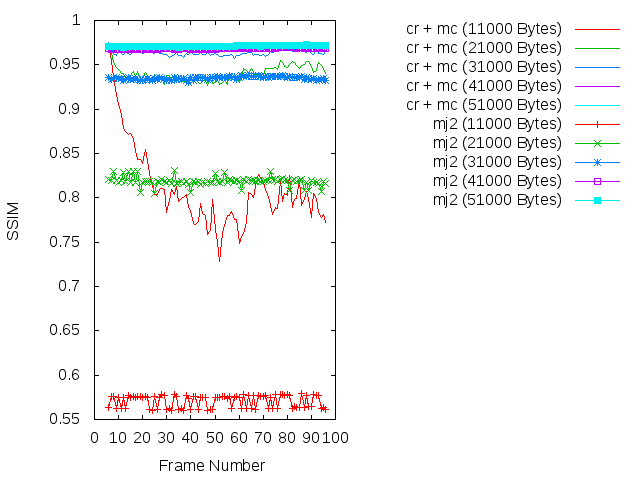
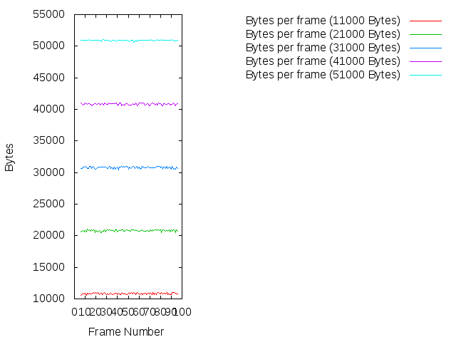

Experiment: 2015-01-22
======================

### Secuencia

- *stockholm*
- Número de imágenes: **90**

### Información de la secuencia
* Parámetros para la estimación de movimiento:
```
    X=1280
    Y=768
    B=128   # block size
    A=0     # subpixel accuracy = sub-pixel accuracy of the motion estimation
    D=0     # border size = size of the border of the blocks in the motion estimation process
    S=4     # search range = size of the searching area of the motion estimation
    V=2     # Overlapping (Para difuminar los bordes de los bloques)
```

* Parámetros de **kdu_compress**:

```
    CLAYERS=8
    CLEVELS=2
    CPRECINCTS="{128,128},{64,64},{32,32}"
    CBLK="{32,32}"
```

* Layer size (in bytes):

```
    Resolution level: 0
    Layer: 1     Size: 51,228
    Layer: 2     Size: 73,148
    Layer: 3     Size: 103,591
    Layer: 4     Size: 146,006
    Layer: 5     Size: 205,071
    Layer: 6     Size: 289,281
    Layer: 7     Size: 406,765
    Layer: 8     Size: 587,788

    Resolution level: 1
    Layer: 1     Size: 40,280
    Layer: 2     Size: 63,850
    Layer: 3     Size: 85,723
    Layer: 4     Size: 123,096
    Layer: 5     Size: 155,624
    Layer: 6     Size: 231,730
    Layer: 7     Size: 314,835
    Layer: 8     Size: 433,559

    Resolution level: 2
    Layer: 1     Size: 23,642
    Layer: 2     Size: 52,444
    Layer: 3     Size: 80,622
    Layer: 4     Size: 104,102
    Layer: 5     Size: 148,911
    Layer: 6     Size: 213,263
    Layer: 7     Size: 295,114
    Layer: 8     Size: 407,245
```

### Descripción

- Este experimento compara cómo sería la transmisión siguiendo el algoritmo
  **cr** frente a una transmisión Motion JPEG2000 (**mj2**). 
- La transmisión Motion JPEG2000 se simula truncando el *code-stream* a
  un determinado bitrate.
- La transmisión **cr** utiliza los siguientes parámetros:
    - WoisToCache: Modo 1 (Se transmiten todas las capas de calidad de cada precinto)
    - Utiliza **mc**: Sí
    - Utiliza Knapsack: No
    - Bitrate estimado: De **11000 bytes** a **51000** para cada frame

PSNR and SSIM
=============

### PSNR


* [Más información](md/psnr.md)

### SSIM



* [Más información](md/ssim.md)

### Average
* 11000 bytes
```
  * PSNR(cr + mc):       23.3294398681
  * PSNR(mj2):           13.0596263407
  * SSIM(cr + mc):       0.808326923077
  * SSIM(mj2):           0.570657802198
```

* 21000 bytes
```
  * PSNR(cr + mc):       28.4533728791
  * PSNR(mj2):           17.3761723846
  * SSIM(cr + mc):       0.94003010989
  * SSIM(mj2):           0.818573186813
```

* 31000 bytes
```
  * PSNR(cr + mc):       30.7735468352
  * PSNR(mj2):           27.0167665385
  * SSIM(cr + mc):       0.963058131868
  * SSIM(mj2):           0.934957912088
```

* 41000 bytes
```
  * PSNR(cr + mc):       31.5043746374
  * PSNR(mj2):           30.0717948242
  * SSIM(cr + mc):       0.968264065934
  * SSIM(mj2):           0.968323516484
```

* 51000 bytes
```
  * PSNR(cr + mc):       31.9218378462
  * PSNR(mj2):           31.8785712637
  * SSIM(cr + mc):       0.971164505495
  * SSIM(mj2):           0.971140989011
```

Codestream recibido para cada imagen
=============



* [Más información](md/bytes.md) 

Simulación de los resultados
=============

* Original:  
  
* [Bitrate: 11.000 bytes](md/gif_11000.md)
* [Bitrate: 21.000 bytes](md/gif_21000.md)
* [Bitrate: 31.000 bytes](md/gif_31000.md)
* [Bitrate: 41.000 bytes](md/gif_41000.md)