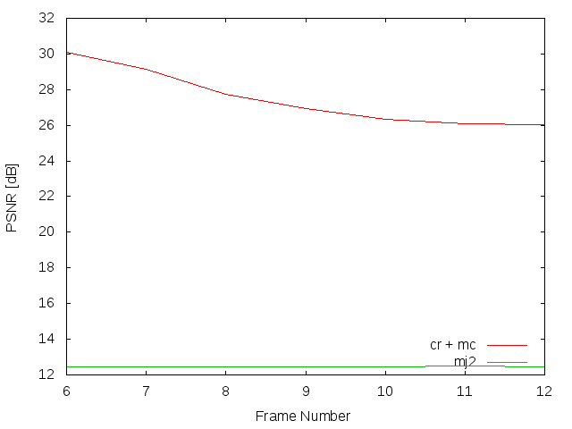
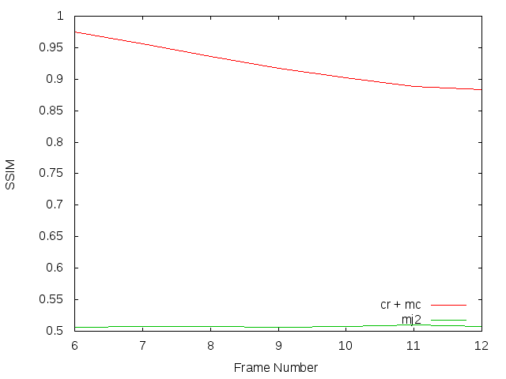
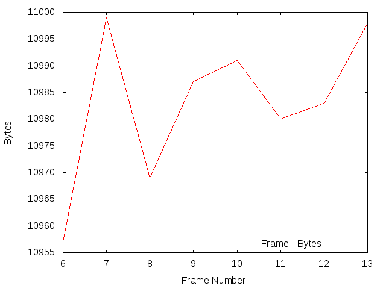

Experiment: 2015-02-19
======================

### Secuencia

- *stockholm*
- Número de imágenes: **7**

### Información de la secuencia
* Parámetros para la estimación de movimiento:
```
    X=1280
    Y=768
    B=32   # block size
    A=0     # subpixel accuracy = sub-pixel accuracy of the motion estimation
    D=0     # border size = size of the border of the blocks in the motion estimation process
    S=4     # search range = size of the searching area of the motion estimation
    V=0     # Overlapping (Para difuminar los bordes de los bloques)
```

* Parámetros de **kdu_compress**:

```
    CLAYERS=8
    CLEVELS=2
    CPRECINCTS="{32,32},{16,16},{8,8}"
    CBLK="{8,8}"
```

* Layer size (in bytes):

```
    Resolution level: 0
    Layer: 1     Size: 65,339
    Layer: 2     Size: 104,153
    Layer: 3     Size: 150,594
    Layer: 4     Size: 208,029
    Layer: 5     Size: 280,865
    Layer: 6     Size: 375,263
    Layer: 7     Size: 500,874
    Layer: 8     Size: 849,786
```

### Descripción

- Este experimento compara cómo sería la transmisión siguiendo el algoritmo
  **cr** frente a una transmisión Motion JPEG2000 (**mj2**). 
- La transmisión Motion JPEG2000 se simula truncando el *code-stream* a
  un determinado bitrate.
- La transmisión **cr** utiliza los siguientes parámetros:
    - WoisToCache: Modo AUTO
    - Utiliza Knapsack: Sí
    - Utiliza **mc**: Sí
    - Bitrate estimado: **11000 bytes**

PSNR and SSIM
=============

### PSNR



### SSIM



### Average
* 11000 bytes
```
  * PSNR(cr + mc):      27.4821858571
  * PSNR(mj2):          12.4517101429
  * SSIM(cr + mc):      0.922637142857
  * SSIM(mj2):          0.507695714286
```

Codestream recibido para cada imagen
=============



Simulación de los resultados
=============

* Bitrate: 11.000 bytes. [gif](gif/all_11000.gif) | [ogv](ogv/all_11000.ogv)