Experiment: 2015-03-02
======================

### Secuencia

- *speedway*
- Número de imágenes: **50**

### Información de la secuencia
* Parámetros para la estimación de movimiento:
```
    X=384
    Y=320
    B=64    # block size
    A=0     # subpixel accuracy = sub-pixel accuracy of the motion estimation
    D=0     # border size = size of the border of the blocks in the motion estimation process
    S=4     # search range = size of the searching area of the motion estimation
    V=2     # Overlapping (Para difuminar los bordes de los bloques)
```

* Parámetros de **kdu_compress**:

```
    CLAYERS=8
    CLEVELS=2
    CPRECINCTS="{64,64},{32,32},{16,16}"
    CBLK="{16,16}"
```

* Layer size (in bytes):

```
    Resolution level: 0
    Layer: 1     Size: 5,354
    Layer: 2     Size: 7,830
    Layer: 3     Size: 11,050
    Layer: 4     Size: 15,336
    Layer: 5     Size: 21,136
    Layer: 6     Size: 29,117
    Layer: 7     Size: 40,119
    Layer: 8     Size: 61,655
```

### Descripción

- Este experimento compara cómo sería la transmisión siguiendo el algoritmo
  **cr** frente a una transmisión Motion JPEG2000 (**mj2**). 
- La transmisión Motion JPEG2000 se simula truncando el *code-stream* a
  un determinado bitrate.
- La transmisión **cr** utiliza los siguientes parámetros:
    - WoisToCache: Modo 2 / Enviando 8 capas completas para precinto
    - Utiliza Knapsack: No
    - Utiliza **mc**: No
    - Bitrate estimado: De **1000 bytes** a **48000 bytes**

PSNR and SSIM
=============

### PSNR


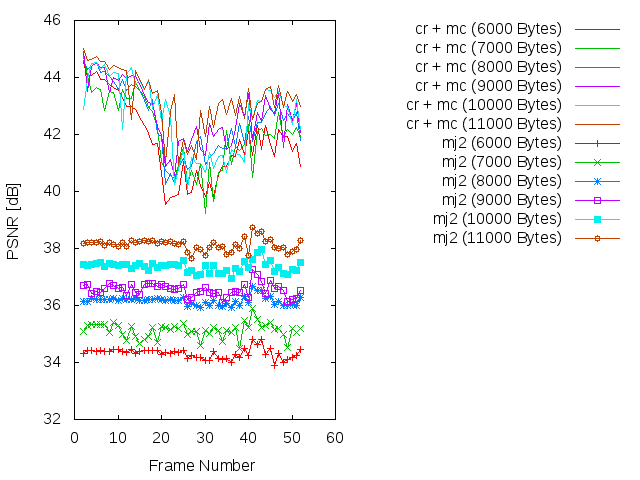
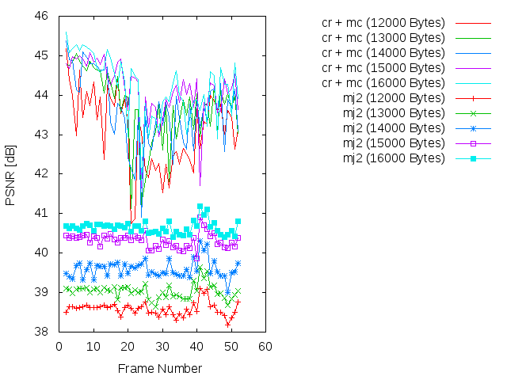
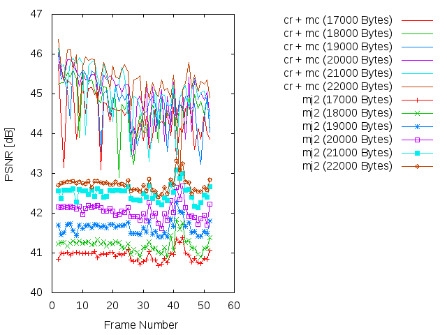
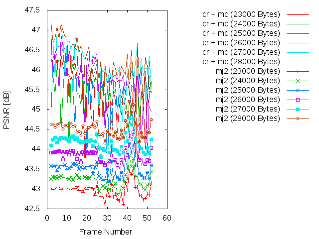
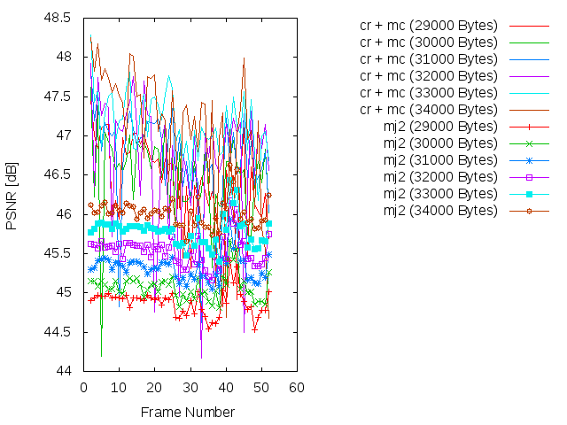
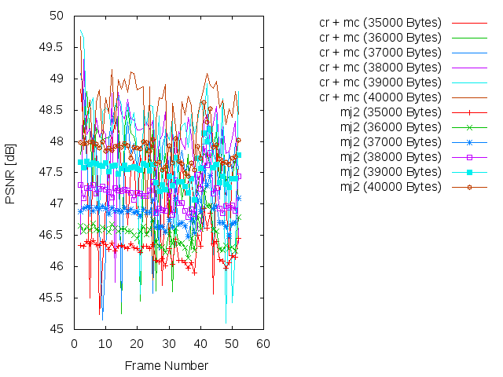
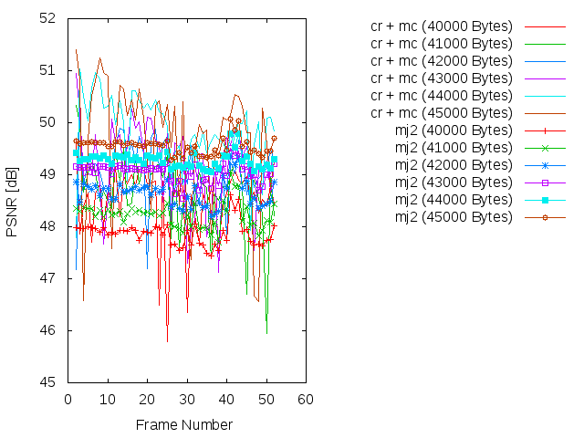

### SSIM

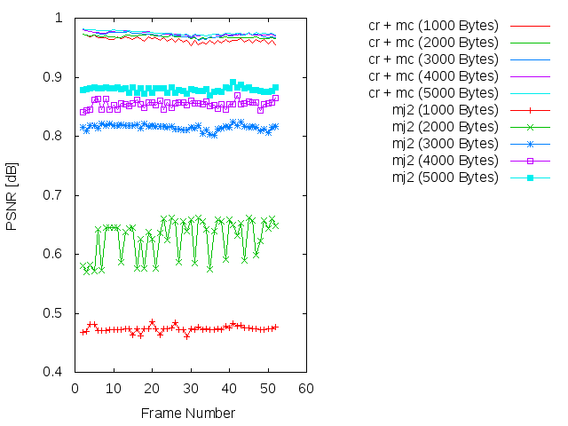
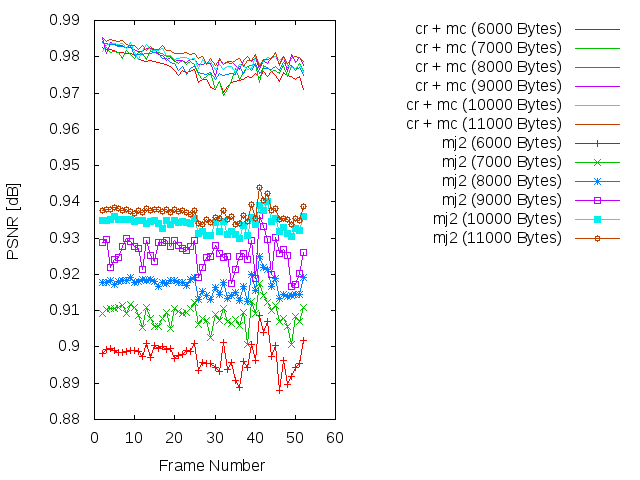
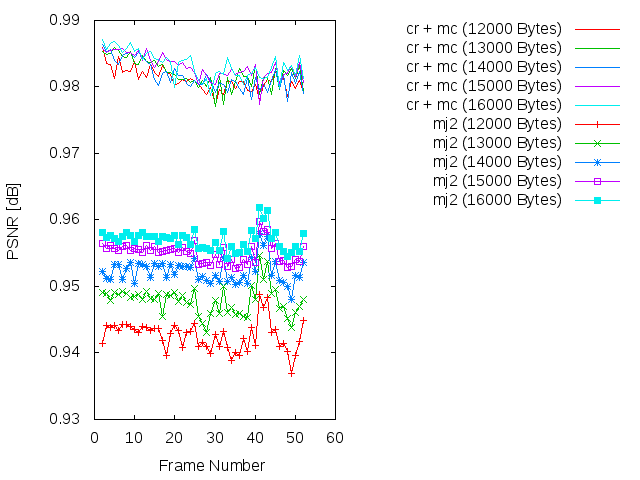
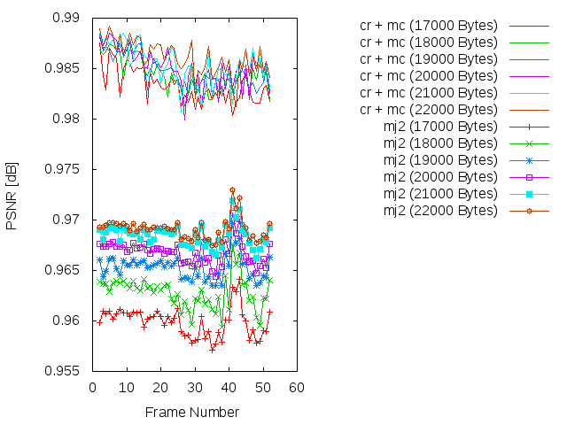
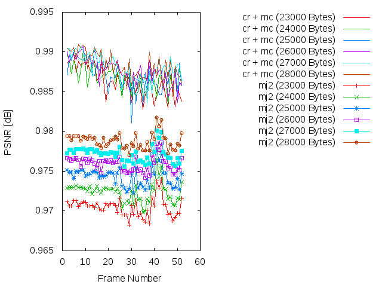
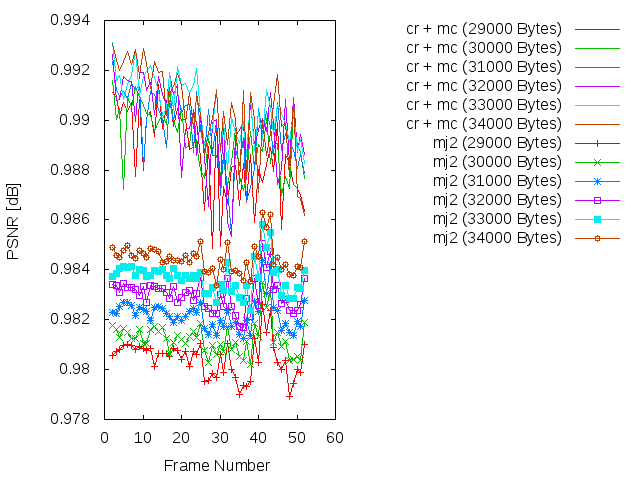
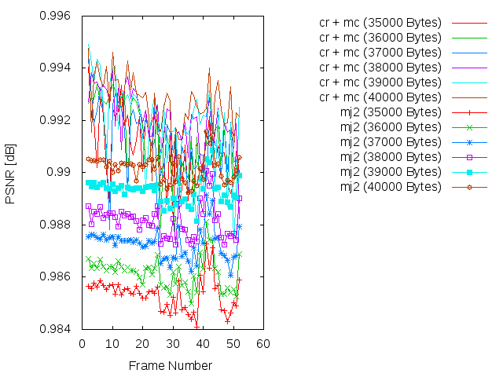
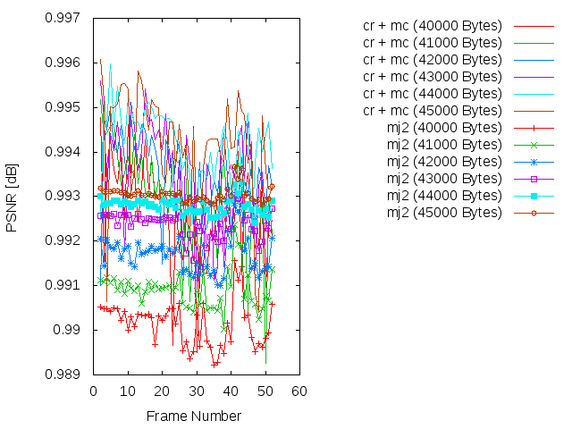

### Average
* 1000 bytes
```
* PSNR(cr + mc):       35.7398137451
* PSNR(mj2):           10.5301132941
* SSIM(cr + mc):       0.963251568627
* SSIM(mj2):           0.47353
```

* 6000 bytes
```
* PSNR(cr + mc):       41.7602903137
* PSNR(mj2):           34.3225742941
* SSIM(cr + mc):       0.976160588235
* SSIM(mj2):           0.89752745098
```

* 12000 bytes
```
* PSNR(cr + mc):       43.1109470196
* PSNR(mj2):           38.5854914118
* SSIM(cr + mc):       0.98107254902
* SSIM(mj2):           0.942581764706
```

* 17000 bytes
```
* PSNR(cr + mc):       44.3762832353
* PSNR(mj2):           40.9369855882
* SSIM(cr + mc):       0.983277843137
* SSIM(mj2):           0.959889607843
```

* 23000 bytes
```
* PSNR(cr + mc):       45.3469649216
* PSNR(mj2):           42.9681220784
* SSIM(cr + mc):       0.986258431373
* SSIM(mj2):           0.97049254902
```

* 29000 bytes
```
* PSNR(cr + mc):       46.3981236863
* PSNR(mj2):           44.8782839216
* SSIM(cr + mc):       0.988672745098
* SSIM(mj2):           0.980447843137
```

* 35000 bytes
```
* PSNR(cr + mc):       47.3345246863
* PSNR(mj2):           46.2804773137
* SSIM(cr + mc):       0.99090372549
* SSIM(mj2):           0.98533627451
```

* 40000 bytes
```
* PSNR(cr + mc):       48.4820311373
* PSNR(mj2):           47.8622408235
* SSIM(cr + mc):       0.992655490196
* SSIM(mj2):           0.990147058824
```

Simulación de los resultados
=============

* Bitrate: 1000 bytes. [gif](gif/all_1000.gif) | [ogv](ogv/all_1000.ogv)
* Bitrate: 2000 bytes. [gif](gif/all_2000.gif) | [ogv](ogv/all_2000.ogv)
* Bitrate: 3000 bytes. [gif](gif/all_3000.gif) | [ogv](ogv/all_3000.ogv)
* Bitrate: 4000 bytes. [gif](gif/all_4000.gif) | [ogv](ogv/all_4000.ogv)
* Bitrate: 5000 bytes. [gif](gif/all_5000.gif) | [ogv](ogv/all_5000.ogv)
* Bitrate: 6000 bytes. [gif](gif/all_6000.gif) | [ogv](ogv/all_6000.ogv)
* Bitrate: 7000 bytes. [gif](gif/all_7000.gif) | [ogv](ogv/all_7000.ogv)
* Bitrate: 8000 bytes. [gif](gif/all_8000.gif) | [ogv](ogv/all_8000.ogv)
* Bitrate: 9000 bytes. [gif](gif/all_9000.gif) | [ogv](ogv/all_9000.ogv)
* Bitrate: 10000 bytes. [gif](gif/all_10000.gif) | [ogv](ogv/all_10000.ogv)
* Bitrate: 11000 bytes. [gif](gif/all_11000.gif) | [ogv](ogv/all_11000.ogv)
* Bitrate: 12000 bytes. [gif](gif/all_12000.gif) | [ogv](ogv/all_12000.ogv)
* Bitrate: 13000 bytes. [gif](gif/all_13000.gif) | [ogv](ogv/all_13000.ogv)
* Bitrate: 14000 bytes. [gif](gif/all_14000.gif) | [ogv](ogv/all_14000.ogv)
* Bitrate: 15000 bytes. [gif](gif/all_15000.gif) | [ogv](ogv/all_15000.ogv)
* Bitrate: 16000 bytes. [gif](gif/all_16000.gif) | [ogv](ogv/all_16000.ogv)
* Bitrate: 17000 bytes. [gif](gif/all_17000.gif) | [ogv](ogv/all_17000.ogv)
* Bitrate: 18000 bytes. [gif](gif/all_18000.gif) | [ogv](ogv/all_18000.ogv)
* Bitrate: 19000 bytes. [gif](gif/all_19000.gif) | [ogv](ogv/all_19000.ogv)
* Bitrate: 20000 bytes. [gif](gif/all_20000.gif) | [ogv](ogv/all_20000.ogv)
* Bitrate: 21000 bytes. [gif](gif/all_21000.gif) | [ogv](ogv/all_21000.ogv)
* Bitrate: 22000 bytes. [gif](gif/all_22000.gif) | [ogv](ogv/all_22000.ogv)
* Bitrate: 23000 bytes. [gif](gif/all_23000.gif) | [ogv](ogv/all_23000.ogv)
* Bitrate: 24000 bytes. [gif](gif/all_24000.gif) | [ogv](ogv/all_24000.ogv)
* Bitrate: 25000 bytes. [gif](gif/all_25000.gif) | [ogv](ogv/all_25000.ogv)
* Bitrate: 26000 bytes. [gif](gif/all_26000.gif) | [ogv](ogv/all_26000.ogv)
* Bitrate: 27000 bytes. [gif](gif/all_27000.gif) | [ogv](ogv/all_27000.ogv)
* Bitrate: 28000 bytes. [gif](gif/all_28000.gif) | [ogv](ogv/all_28000.ogv)
* Bitrate: 29000 bytes. [gif](gif/all_29000.gif) | [ogv](ogv/all_29000.ogv)
* Bitrate: 30000 bytes. [gif](gif/all_30000.gif) | [ogv](ogv/all_30000.ogv)
* Bitrate: 31000 bytes. [gif](gif/all_31000.gif) | [ogv](ogv/all_31000.ogv)
* Bitrate: 32000 bytes. [gif](gif/all_32000.gif) | [ogv](ogv/all_32000.ogv)
* Bitrate: 33000 bytes. [gif](gif/all_33000.gif) | [ogv](ogv/all_33000.ogv)
* Bitrate: 34000 bytes. [gif](gif/all_34000.gif) | [ogv](ogv/all_34000.ogv)
* Bitrate: 35000 bytes. [gif](gif/all_35000.gif) | [ogv](ogv/all_35000.ogv)
* Bitrate: 36000 bytes. [gif](gif/all_36000.gif) | [ogv](ogv/all_36000.ogv)
* Bitrate: 37000 bytes. [gif](gif/all_37000.gif) | [ogv](ogv/all_37000.ogv)
* Bitrate: 31000 bytes. [gif](gif/all_38000.gif) | [ogv](ogv/all_38000.ogv)
* Bitrate: 39000 bytes. [gif](gif/all_39000.gif) | [ogv](ogv/all_39000.ogv)
* Bitrate: 40000 bytes. [gif](gif/all_40000.gif) | [ogv](ogv/all_40000.ogv)
* Bitrate: 41000 bytes. [gif](gif/all_41000.gif) | [ogv](ogv/all_41000.ogv)
* Bitrate: 42000 bytes. [gif](gif/all_42000.gif) | [ogv](ogv/all_42000.ogv)
* Bitrate: 43000 bytes. [gif](gif/all_43000.gif) | [ogv](ogv/all_43000.ogv)
* Bitrate: 44000 bytes. [gif](gif/all_44000.gif) | [ogv](ogv/all_44000.ogv)
* Bitrate: 45000 bytes. [gif](gif/all_45000.gif) | [ogv](ogv/all_45000.ogv)
* Bitrate: 46000 bytes. [gif](gif/all_46000.gif) | [ogv](ogv/all_41000.ogv)
* Bitrate: 47000 bytes. [gif](gif/all_47000.gif) | [ogv](ogv/all_47000.ogv)
* Bitrate: 48000 bytes. [gif](gif/all_48000.gif) | [ogv](ogv/all_48000.ogv)
