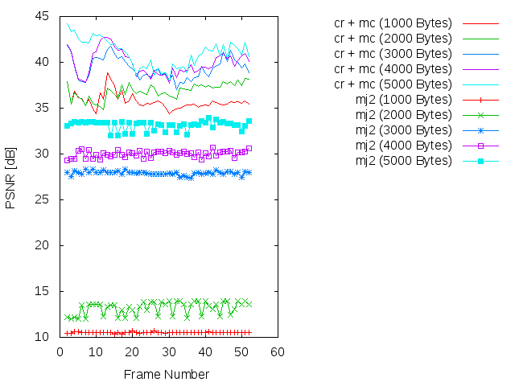

Experiment: 2015-03-01
======================

### Secuencia

- *speedway*
- Número de imágenes: **50**

### Información de la secuencia
* Parámetros para la estimación de movimiento:
```
    X=384
    Y=320
    B=64    # block size
    A=0     # subpixel accuracy = sub-pixel accuracy of the motion estimation
    D=0     # border size = size of the border of the blocks in the motion estimation process
    S=4     # search range = size of the searching area of the motion estimation
    V=2     # Overlapping (Para difuminar los bordes de los bloques)
```

* Parámetros de **kdu_compress**:

```
    CLAYERS=8
    CLEVELS=2
    CPRECINCTS="{64,64},{32,32},{16,16}"
    CBLK="{16,16}"
```

* Layer size (in bytes):

```
    Resolution level: 0
    Layer: 1     Size: 5,354
    Layer: 2     Size: 7,830
    Layer: 3     Size: 11,050
    Layer: 4     Size: 15,336
    Layer: 5     Size: 21,136
    Layer: 6     Size: 29,117
    Layer: 7     Size: 40,119
    Layer: 8     Size: 61,655
```

### Descripción

- Este experimento compara cómo sería la transmisión siguiendo el algoritmo
  **cr** frente a una transmisión Motion JPEG2000 (**mj2**). 
- La transmisión Motion JPEG2000 se simula truncando el *code-stream* a
  un determinado bitrate.
- La transmisión **cr** utiliza los siguientes parámetros:
    - WoisToCache: Modo 2 / Enviando 8 capas completas para precinto
    - Utiliza Knapsack: No
    - Utiliza **mc**: No
    - Bitrate estimado: De **1000 bytes** a **61000 bytes**

PSNR and SSIM
=============

### PSNR




### SSIM


### Average
* 11000 bytes
```
  * PSNR(cr + mc):      23.3650149231
  * PSNR(mj2):          13.041338044
  * SSIM(cr + mc):      0.787991428571
  * SSIM(mj2):          0.568899450549
```

Codestream recibido para cada imagen
=============


Simulación de los resultados
=============

* Bitrate: 11.000 bytes. [gif](gif/all_11000.gif) | [ogv](ogv/all_11000.ogv)