Experiment: 2015-03-02
======================

### Secuencia

- *speedway*
- Número de imágenes: **50**

### Información de la secuencia
* Parámetros para la estimación de movimiento

```
X=384
Y=320
B=64   # block size
A=0     # subpixel accuracy = sub-pixel accuracy of the motion estimation
D=0     # border size = size of the border of the blocks in the motion estimation process
S=4     # search range = size of the searching area of the motion estimation
V=2     # Overlapping. Para difuminar los bordes de los bloques.
```

* Parámetros de **kdu_compress**:

```
    CLAYERS=8
    CLEVELS=2
    CPRECINCTS="{64,64},{32,32},{16,16}"
    CBLK="{16,16}"
```

* Layer size (in bytes):

```
    Resolution level: 0
    Layer: 1     Size: 5,354
    Layer: 2     Size: 7,830
    Layer: 3     Size: 11,050
    Layer: 4     Size: 15,336
    Layer: 5     Size: 21,136
    Layer: 6     Size: 29,117
    Layer: 7     Size: 40,119
    Layer: 8     Size: 61,655
```

### Descripción

- Este experimento compara cómo sería la transmisión siguiendo el algoritmo
  **cr** frente a una transmisión Motion JPEG2000 (**mj2**). 
- La transmisión Motion JPEG2000 se simula truncando el *code-stream* a
  un determinado bitrate.
- La transmisión **cr** utiliza los siguientes parámetros:
    - WoisToCache: Modo 2 / Enviando 8 capas completas para precinto
    - Utiliza Knapsack: No
    - Utiliza **mc**: Sí
    - Bitrate estimado: De **1000 bytes** a **60000 bytes**

PSNR and SSIM
=============

### PSNR

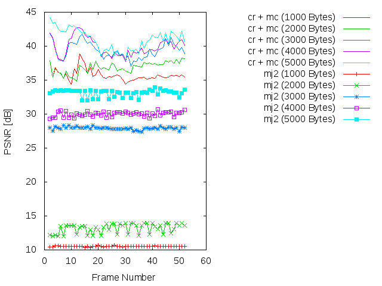
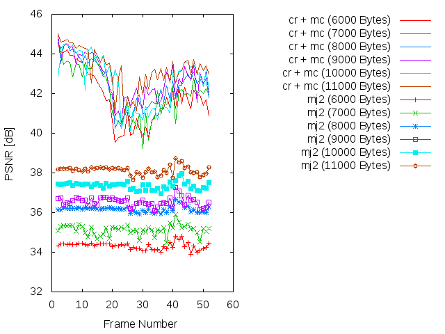
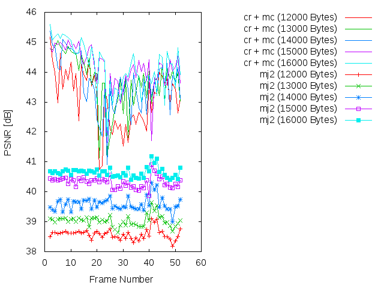
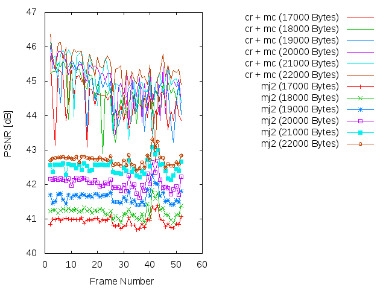
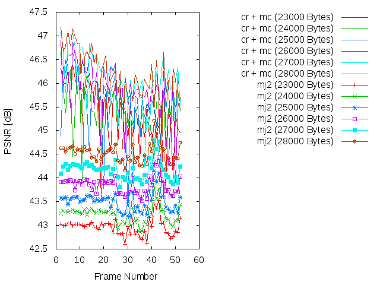
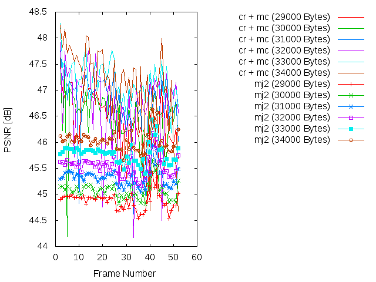
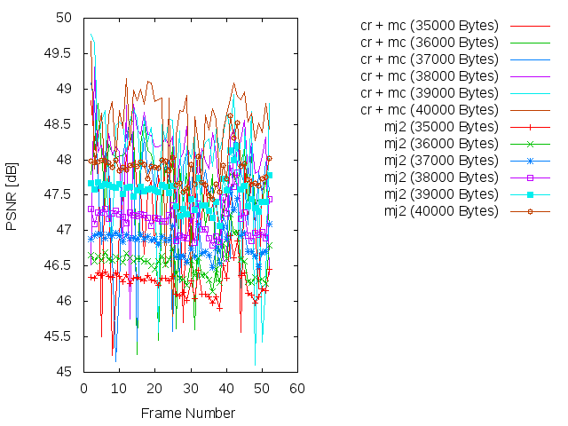
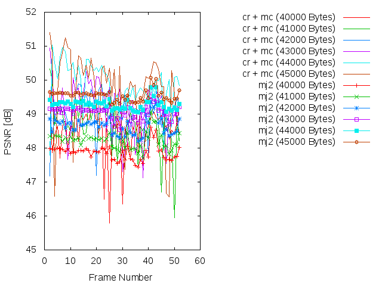

### SSIM

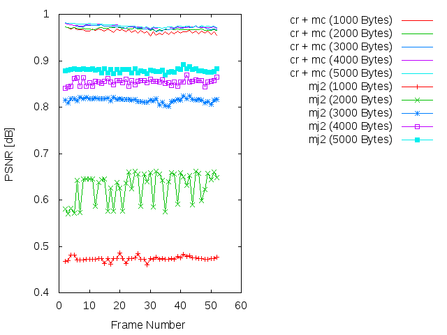
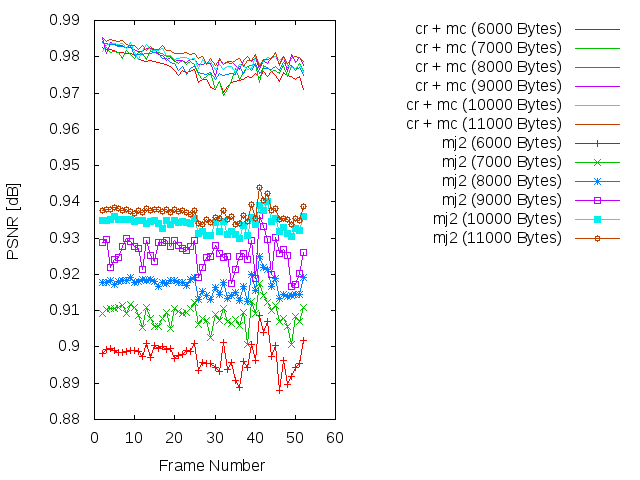
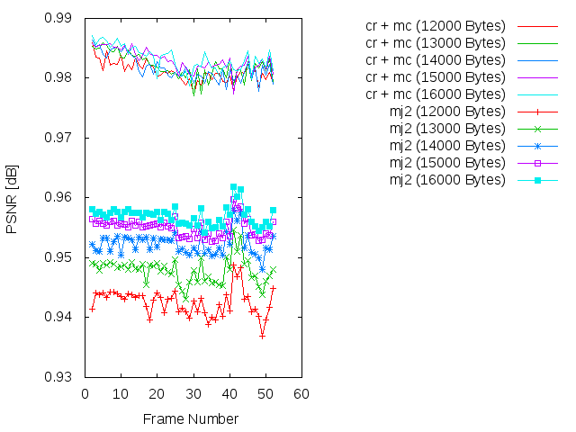
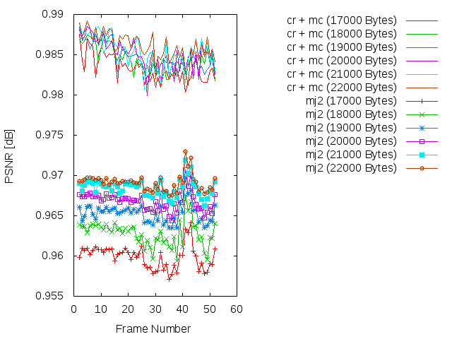
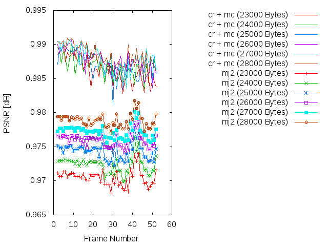
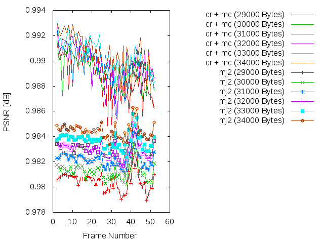
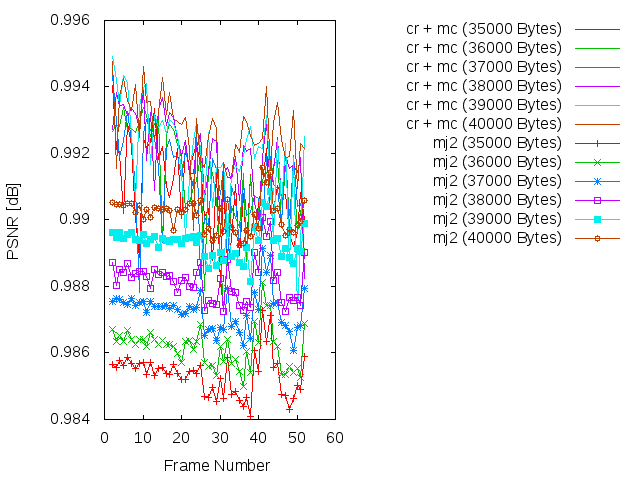
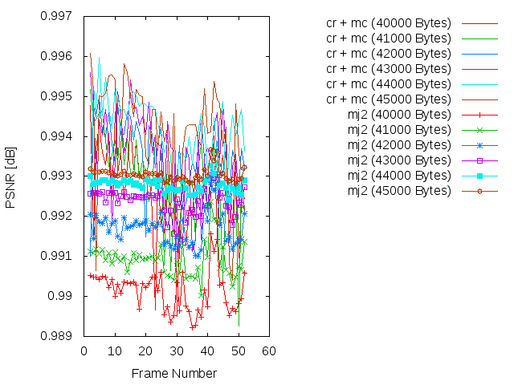

### Average

| PSNR-SSIM \ Bytes | 1000            | 2000            | 3000            | 4000            | 5000           
| ----------------- | --------------- | --------------- | --------------- | --------------- | ---------------
| **PSNR(cr + mc)** | 35.7398137451   | 36.8547223725   | 39.3608302157   | 39.9052979608   | 40.9849586078  
| **PSNR(mj2)**     | 10.5301132941   | 13.1877860784   | 27.9143563922   | 30.0100833529   | 33.1430604706  
| **SSIM(cr + mc)** |  0.963251568627 |  0.968475098039 |  0.971549215686 |  0.974020980392 |  0.975141764706 
| **SSIM(mj2)**     |  0.47353        |  0.627437843137 |  0.815145294118 |  0.854017058824 |  0.879057058824 

| PSNR-SSIM \ Bytes | 6000            | 7000            | 8000            | 9000            | 10000           
| ----------------- | --------------- | --------------- | --------------- | --------------- | ---------------
| **PSNR(cr + mc)** | 41.7602903137   | 42.0302293137   | 42.4846601569   | 42.7542750588   | 42.6252801373
| **PSNR(mj2)**     | 34.3225742941   | 35.1232917843   | 36.166167902    | 36.5589571765   | 37.3634580784
| **SSIM(cr + mc)** |  0.976160588235 |  0.977649411765 |  0.978159803922 |  0.979727254902 |  0.97956745098
| **SSIM(mj2)**     |  0.89752745098  |  0.908724117647 |  0.916958431373 |  0.925800980392 |  0.933874313725

| PSNR-SSIM \ Bytes | 11000           | 12000           | 13000           | 14000           | 150000           
| ----------------- | --------------- | --------------- | --------------- | --------------- | ---------------
| **PSNR(cr + mc)** | 43.2303620784   | 43.1109470196   | 43.7059633137   | 43.633451098    | 44.1501121176
| **PSNR(mj2)**     | 38.1315834706   | 38.5854914118   | 39.0321088235   | 39.5962841961   | 40.3214633922
| **SSIM(cr + mc)** | 0.98071254902   | 0.98107254902   |  0.982045490196 |  0.98168745098  | 0.983048627451
| **SSIM(mj2)**     | 0.936932745098  | 0.942581764706  |  0.947865490196 |  0.952322156863 | 0.955071568627

| PSNR-SSIM \ Bytes | 16000           | 17000           | 18000           | 19000           | 200000           
| ----------------- | --------------- | --------------- | --------------- | --------------- | ---------------
| **PSNR(cr + mc)** | 44.2106961569   | 44.3762832353   | 44.6686513137   | 44.7578180196   | 45.0075043137
| **PSNR(mj2)**     | 40.6466981961   | 40.9369855882   | 41.2087602353   | 41.6358927255   | 42.0507357255
| **SSIM(cr + mc)** |  0.983308235294 |  0.983277843137 |  0.984400196078 |  0.984679607843 | 0.985103921569
| **SSIM(mj2)**     |  0.95702        |  0.959889607843 |  0.962817843137 |  0.965303137255 | 0.966837647059


--------------------------------------------------
```
* 21000 bytes
* PSNR(cr + mc):       45.0155661961
* PSNR(mj2):           42.5043505882
* SSIM(cr + mc):       0.985399215686
* SSIM(mj2):           0.968446666667

* 22000 bytes
* PSNR(cr + mc):       45.3128576275
* PSNR(mj2):           42.7225842353
* SSIM(cr + mc):       0.986118823529
* SSIM(mj2):           0.969082156863

* 23000 bytes
* PSNR(cr + mc):       45.3469649216
* PSNR(mj2):           42.9681220784
* SSIM(cr + mc):       0.986258431373
* SSIM(mj2):           0.97049254902

* 24000 bytes
* PSNR(cr + mc):       45.4725946275
* PSNR(mj2):           43.2326259216
* SSIM(cr + mc):       0.986688627451
* SSIM(mj2):           0.972381764706

* 25000 bytes
* PSNR(cr + mc):       45.5932764706
* PSNR(mj2):           43.5063010196
* SSIM(cr + mc):       0.986964705882
* SSIM(mj2):           0.974338039216

* 26000 bytes
* PSNR(cr + mc):       45.8169044706
* PSNR(mj2):           43.8529881176
* SSIM(cr + mc):       0.987633529412
* SSIM(mj2):           0.975947058824

* 27000 bytes
* PSNR(cr + mc):       46.1267081765
* PSNR(mj2):           44.1687209804
* SSIM(cr + mc):       0.988121960784
* SSIM(mj2):           0.977194901961

* 28000 bytes
* PSNR(cr + mc):       46.1141390784
* PSNR(mj2):           44.5288262157
* SSIM(cr + mc):       0.98826627451
* SSIM(mj2):           0.978839019608

* 29000 bytes
* PSNR(cr + mc):       46.3981236863
* PSNR(mj2):           44.8782839216
* SSIM(cr + mc):       0.988672745098
* SSIM(mj2):           0.980447843137

* 30000 bytes
* PSNR(cr + mc):       46.492768902
* PSNR(mj2):           45.0754378039
* SSIM(cr + mc):       0.989177647059
* SSIM(mj2):           0.981250784314

* 31000 bytes
* PSNR(cr + mc):       46.7082254118
* PSNR(mj2):           45.3230963725
* SSIM(cr + mc):       0.989563921569
* SSIM(mj2):           0.982201764706

* 32000 bytes
* PSNR(cr + mc):       46.7238345686
* PSNR(mj2):           45.539030098
* SSIM(cr + mc):       0.989843529412
* SSIM(mj2):           0.983006666667

* 33000 bytes
* PSNR(cr + mc):       47.1621707451
* PSNR(mj2):           45.7845793725
* SSIM(cr + mc):       0.990509803922
* SSIM(mj2):           0.983697647059

* 34000 bytes
* PSNR(cr + mc):       47.0822473922
* PSNR(mj2):           46.0222435686
* SSIM(cr + mc):       0.990422941176
* SSIM(mj2):           0.984472156863

* 35000 bytes
* PSNR(cr + mc):       47.3345246863
* PSNR(mj2):           46.2804773137
* SSIM(cr + mc):       0.99090372549
* SSIM(mj2):           0.98533627451

* 36000 bytes
* PSNR(cr + mc):       47.5840259216
* PSNR(mj2):           46.5366812941
* SSIM(cr + mc):       0.991211764706
* SSIM(mj2):           0.986170196078

* 37000 bytes
* PSNR(cr + mc):       47.5342173137
* PSNR(mj2):           46.8576146863
* SSIM(cr + mc):       0.991191176471
* SSIM(mj2):           0.987278431373

* 38000 bytes
* PSNR(cr + mc):       47.969553902
* PSNR(mj2):           47.1572557843
* SSIM(cr + mc):       0.992019803922
* SSIM(mj2):           0.988171764706

* 39000 bytes
* PSNR(cr + mc):       47.9969505882
* PSNR(mj2):           47.5391880196
* SSIM(cr + mc):       0.991985098039
* SSIM(mj2):           0.989317843137

* 40000 bytes
* PSNR(cr + mc):       48.4820311373
* PSNR(mj2):           47.8622408235
* SSIM(cr + mc):       0.992655490196
* SSIM(mj2):           0.990147058824

* 41000 bytes
* PSNR(cr + mc):       48.7145827451
* PSNR(mj2):           48.2210324314
* SSIM(cr + mc):       0.99299254902
* SSIM(mj2):           0.990915294118

* 42000 bytes
* PSNR(cr + mc):       49.1120457255
* PSNR(mj2):           48.6452965098
* SSIM(cr + mc):       0.993502352941
* SSIM(mj2):           0.991698039216

* 43000 bytes
* PSNR(cr + mc):       49.194288
* PSNR(mj2):           49.0518084314
* SSIM(cr + mc):       0.993519019608
* SSIM(mj2):           0.992401176471

* 44000 bytes
* PSNR(cr + mc):       49.8658264902
* PSNR(mj2):           49.2837782941
* SSIM(cr + mc):       0.994213529412
* SSIM(mj2):           0.992792745098

* 45000 bytes
* PSNR(cr + mc):       49.6776013922
* PSNR(mj2):           49.5487510588
* SSIM(cr + mc):       0.994105686275
* SSIM(mj2):           0.993048235294

* 46000 bytes
* PSNR(cr + mc):       50.5839623922
* PSNR(mj2):           49.7860055882
* SSIM(cr + mc):       0.99494627451
* SSIM(mj2):           0.993316470588

* 47000 bytes
* PSNR(cr + mc):       50.3929324706
* PSNR(mj2):           50.0813593922
* SSIM(cr + mc):       0.994818039216
* SSIM(mj2):           0.993750588235

* 48000 bytes
* PSNR(cr + mc):       51.1720147451
* PSNR(mj2):           50.398614
* SSIM(cr + mc):       0.995522745098
* SSIM(mj2):           0.994121176471

* 49000 bytes
* PSNR(cr + mc):       51.528913898
* PSNR(mj2):           50.7275506122
* SSIM(cr + mc):       0.995772857143
* SSIM(mj2):           0.994492244898

* 50000 bytes
* PSNR(cr + mc):       51.917043898
* PSNR(mj2):           51.0075097347
* SSIM(cr + mc):       0.996073673469
* SSIM(mj2):           0.99486877551

* 51000 bytes
* PSNR(cr + mc):       52.2890248571
* PSNR(mj2):           51.3874756735
* SSIM(cr + mc):       0.996352040816
* SSIM(mj2):           0.995330816327

* 52000 bytes
* PSNR(cr + mc):       52.7269646122
* PSNR(mj2):           51.7925072041
* SSIM(cr + mc):       0.996638163265
* SSIM(mj2):           0.995736530612

* 53000 bytes
* PSNR(cr + mc):       53.6688000816
* PSNR(mj2):           52.3076128367
* SSIM(cr + mc):       0.997105714286
* SSIM(mj2):           0.996188571429

* 54000 bytes
* PSNR(cr + mc):       54.2744939592
* PSNR(mj2):           52.8324858163
* SSIM(cr + mc):       0.997441428571
* SSIM(mj2):           0.996586326531

* 55000 bytes
* PSNR(cr + mc):       54.906067898
* PSNR(mj2):           53.3868809388
* SSIM(cr + mc):       0.997740612245
* SSIM(mj2):           0.996971020408

* 56000 bytes
* PSNR(cr + mc):       55.902247551
* PSNR(mj2):           54.1031197551
* SSIM(cr + mc):       0.998095102041
* SSIM(mj2):           0.997474693878

* 57000 bytes
* PSNR(cr + mc):       55.7803266327
* PSNR(mj2):           55.059296551
* SSIM(cr + mc):       0.997931632653
* SSIM(mj2):           0.997931632653

* 58000 bytes
* PSNR(cr + mc):       57.9486009388
* PSNR(mj2):           56.066191898
* SSIM(cr + mc):       0.99876
* SSIM(mj2):           0.998382040816

* 59000 bytes
* PSNR(cr + mc):       58.2806131429
* PSNR(mj2):           57.5542487143
* SSIM(cr + mc):       0.998764285714
* SSIM(mj2):           0.998847142857

* 60000 bytes
* PSNR(cr + mc):       60.3738896531
* PSNR(mj2):           58.0341150612
* SSIM(cr + mc):       0.999387142857
* SSIM(mj2):           0.999216122449
```

Simulación de los resultados
=============

* Bitrate: 1000 bytes. [gif](gif/all_1000.gif) | [ogv](ogv/all_1000.ogv)
* Bitrate: 2000 bytes. [gif](gif/all_2000.gif) | [ogv](ogv/all_2000.ogv)
* Bitrate: 3000 bytes. [gif](gif/all_3000.gif) | [ogv](ogv/all_3000.ogv)
* Bitrate: 4000 bytes. [gif](gif/all_4000.gif) | [ogv](ogv/all_4000.ogv)
* Bitrate: 5000 bytes. [gif](gif/all_5000.gif) | [ogv](ogv/all_5000.ogv)
* Bitrate: 6000 bytes. [gif](gif/all_6000.gif) | [ogv](ogv/all_6000.ogv)
* Bitrate: 7000 bytes. [gif](gif/all_7000.gif) | [ogv](ogv/all_7000.ogv)
* Bitrate: 8000 bytes. [gif](gif/all_8000.gif) | [ogv](ogv/all_8000.ogv)
* Bitrate: 9000 bytes. [gif](gif/all_9000.gif) | [ogv](ogv/all_9000.ogv)
* Bitrate: 10000 bytes. [gif](gif/all_10000.gif) | [ogv](ogv/all_10000.ogv)
* Bitrate: 11000 bytes. [gif](gif/all_11000.gif) | [ogv](ogv/all_11000.ogv)
* Bitrate: 12000 bytes. [gif](gif/all_12000.gif) | [ogv](ogv/all_12000.ogv)
* Bitrate: 13000 bytes. [gif](gif/all_13000.gif) | [ogv](ogv/all_13000.ogv)
* Bitrate: 14000 bytes. [gif](gif/all_14000.gif) | [ogv](ogv/all_14000.ogv)
* Bitrate: 15000 bytes. [gif](gif/all_15000.gif) | [ogv](ogv/all_15000.ogv)
* Bitrate: 16000 bytes. [gif](gif/all_16000.gif) | [ogv](ogv/all_16000.ogv)
* Bitrate: 17000 bytes. [gif](gif/all_17000.gif) | [ogv](ogv/all_17000.ogv)
* Bitrate: 18000 bytes. [gif](gif/all_18000.gif) | [ogv](ogv/all_18000.ogv)
* Bitrate: 19000 bytes. [gif](gif/all_19000.gif) | [ogv](ogv/all_19000.ogv)
* Bitrate: 20000 bytes. [gif](gif/all_20000.gif) | [ogv](ogv/all_20000.ogv)
* Bitrate: 21000 bytes. [gif](gif/all_21000.gif) | [ogv](ogv/all_21000.ogv)
* Bitrate: 22000 bytes. [gif](gif/all_22000.gif) | [ogv](ogv/all_22000.ogv)
* Bitrate: 23000 bytes. [gif](gif/all_23000.gif) | [ogv](ogv/all_23000.ogv)
* Bitrate: 24000 bytes. [gif](gif/all_24000.gif) | [ogv](ogv/all_24000.ogv)
* Bitrate: 25000 bytes. [gif](gif/all_25000.gif) | [ogv](ogv/all_25000.ogv)
* Bitrate: 26000 bytes. [gif](gif/all_26000.gif) | [ogv](ogv/all_26000.ogv)
* Bitrate: 27000 bytes. [gif](gif/all_27000.gif) | [ogv](ogv/all_27000.ogv)
* Bitrate: 28000 bytes. [gif](gif/all_28000.gif) | [ogv](ogv/all_28000.ogv)
* Bitrate: 29000 bytes. [gif](gif/all_29000.gif) | [ogv](ogv/all_29000.ogv)
* Bitrate: 30000 bytes. [gif](gif/all_30000.gif) | [ogv](ogv/all_30000.ogv)
* Bitrate: 31000 bytes. [gif](gif/all_31000.gif) | [ogv](ogv/all_31000.ogv)
* Bitrate: 32000 bytes. [gif](gif/all_32000.gif) | [ogv](ogv/all_32000.ogv)
* Bitrate: 33000 bytes. [gif](gif/all_33000.gif) | [ogv](ogv/all_33000.ogv)
* Bitrate: 34000 bytes. [gif](gif/all_34000.gif) | [ogv](ogv/all_34000.ogv)
* Bitrate: 35000 bytes. [gif](gif/all_35000.gif) | [ogv](ogv/all_35000.ogv)
* Bitrate: 36000 bytes. [gif](gif/all_36000.gif) | [ogv](ogv/all_36000.ogv)
* Bitrate: 37000 bytes. [gif](gif/all_37000.gif) | [ogv](ogv/all_37000.ogv)
* Bitrate: 31000 bytes. [gif](gif/all_38000.gif) | [ogv](ogv/all_38000.ogv)
* Bitrate: 39000 bytes. [gif](gif/all_39000.gif) | [ogv](ogv/all_39000.ogv)
* Bitrate: 40000 bytes. [gif](gif/all_40000.gif) | [ogv](ogv/all_40000.ogv)
* Bitrate: 41000 bytes. [gif](gif/all_41000.gif) | [ogv](ogv/all_41000.ogv)
* Bitrate: 42000 bytes. [gif](gif/all_42000.gif) | [ogv](ogv/all_42000.ogv)
* Bitrate: 43000 bytes. [gif](gif/all_43000.gif) | [ogv](ogv/all_43000.ogv)
* Bitrate: 44000 bytes. [gif](gif/all_44000.gif) | [ogv](ogv/all_44000.ogv)
* Bitrate: 45000 bytes. [gif](gif/all_45000.gif) | [ogv](ogv/all_45000.ogv)
* Bitrate: 46000 bytes. [gif](gif/all_46000.gif) | [ogv](ogv/all_41000.ogv)
* Bitrate: 47000 bytes. [gif](gif/all_47000.gif) | [ogv](ogv/all_47000.ogv)
* Bitrate: 48000 bytes. [gif](gif/all_48000.gif) | [ogv](ogv/all_48000.ogv)
* Bitrate: 49000 bytes. [gif](gif/all_49000.gif) | [ogv](ogv/all_49000.ogv)
* Bitrate: 50000 bytes. [gif](gif/all_50000.gif) | [ogv](ogv/all_50000.ogv)
* Bitrate: 51000 bytes. [gif](gif/all_51000.gif) | [ogv](ogv/all_51000.ogv)
* Bitrate: 52000 bytes. [gif](gif/all_52000.gif) | [ogv](ogv/all_52000.ogv)
* Bitrate: 53000 bytes. [gif](gif/all_53000.gif) | [ogv](ogv/all_53000.ogv)
* Bitrate: 54000 bytes. [gif](gif/all_54000.gif) | [ogv](ogv/all_54000.ogv)
* Bitrate: 55000 bytes. [gif](gif/all_55000.gif) | [ogv](ogv/all_55000.ogv)
* Bitrate: 56000 bytes. [gif](gif/all_56000.gif) | [ogv](ogv/all_51000.ogv)
* Bitrate: 57000 bytes. [gif](gif/all_57000.gif) | [ogv](ogv/all_57000.ogv)
* Bitrate: 58000 bytes. [gif](gif/all_58000.gif) | [ogv](ogv/all_58000.ogv)
* Bitrate: 59000 bytes. [gif](gif/all_59000.gif) | [ogv](ogv/all_59000.ogv)
* Bitrate: 60000 bytes. [gif](gif/all_60000.gif) | [ogv](ogv/all_60000.ogv)