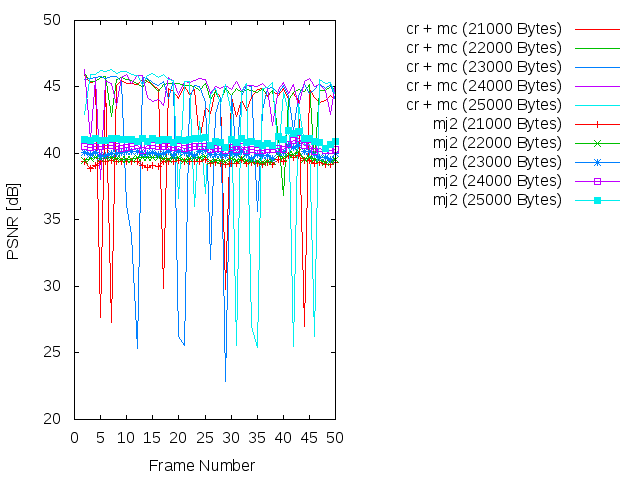
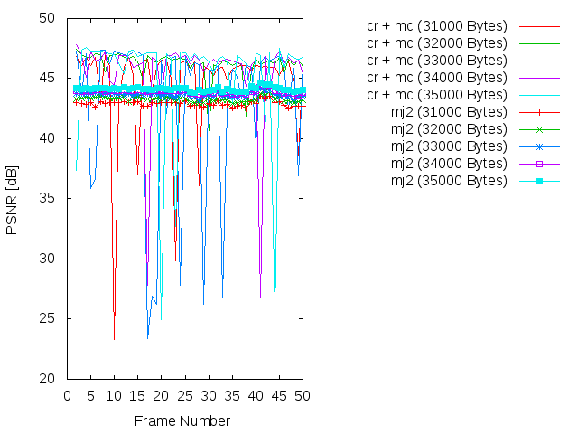
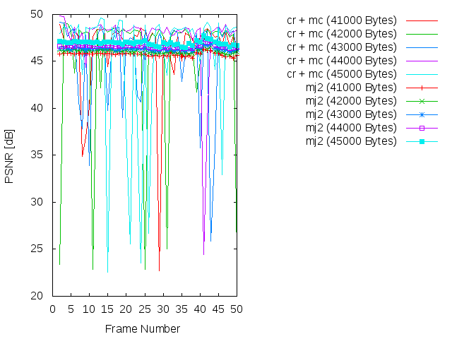
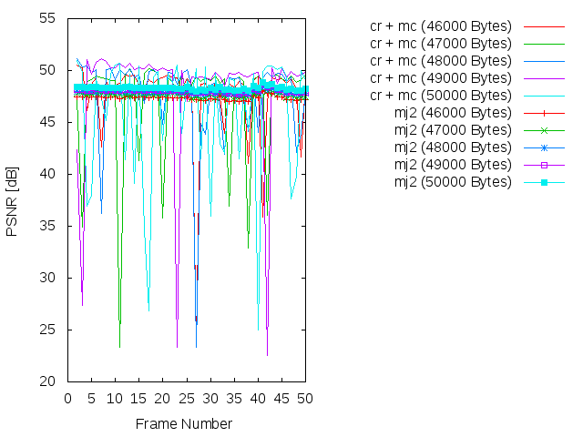
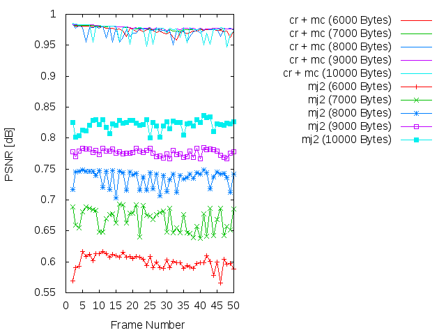
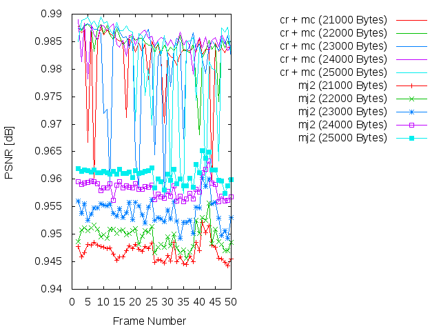
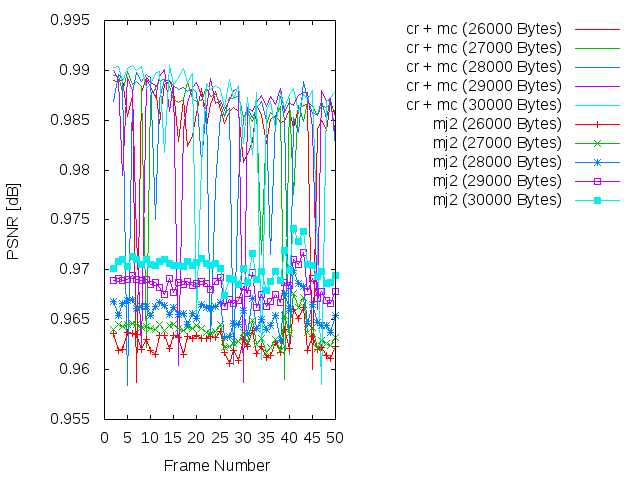
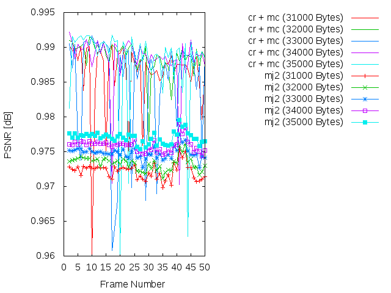
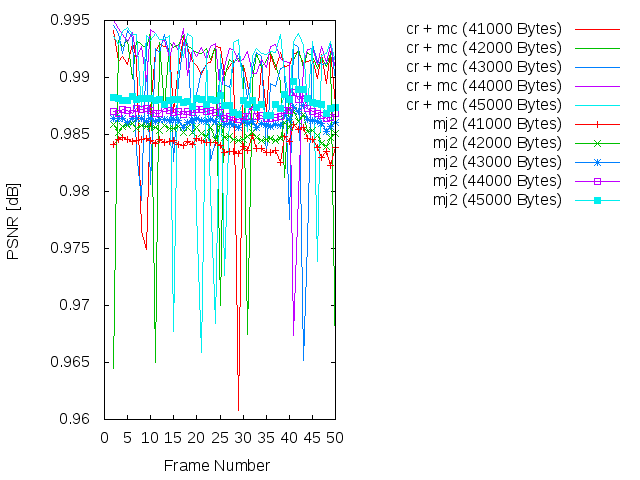

Experiment: 2015-03-03
======================

### Secuencia

- *speedway*
- Número de imágenes: **50**

### Información de la secuencia
* ~~Parámetros para la estimación de movimiento~~ 

* Parámetros de **kdu_compress**:

```
    CLAYERS=20
    CLEVELS=2
    CPRECINCTS="{64,64},{32,32},{16,16}"
    CBLK="{16,16}"
```

* Layer size (in bytes):

```
    Resolution level: 0
    Layer: 1     Size: 1,198
    Layer: 2     Size: 1,858
    Layer: 3     Size: 2,522
    Layer: 4     Size: 3,204
    Layer: 5     Size: 3,903
    Layer: 6     Size: 4,629
    Layer: 7     Size: 5,393
    Layer: 8     Size: 6,217
    Layer: 9     Size: 7,119
    Layer: 10    Size: 8,127
    Layer: 11    Size: 9,317
    Layer: 12    Size: 10,719
    Layer: 13    Size: 12,428
    Layer: 14    Size: 14,627
    Layer: 15    Size: 17,446
    Layer: 16    Size: 21,173
    Layer: 17    Size: 26,161
    Layer: 18    Size: 32,943
    Layer: 19    Size: 42,343
    Layer: 20    Size: 69,159
```

### Descripción

- Este experimento compara cómo sería la transmisión siguiendo el algoritmo
  **cr** frente a una transmisión Motion JPEG2000 (**mj2**). 
- La transmisión Motion JPEG2000 se simula truncando el *code-stream* a
  un determinado bitrate.
- La transmisión **cr** utiliza los siguientes parámetros:
    - WoisToCache: Modo 2 / Enviando 20 capas completas para precinto
    - Utiliza Knapsack: No
    - Utiliza **mc**: No
    - Bitrate estimado: De **1000 bytes** a **48000 bytes**

PSNR and SSIM
=============

### PSNR









### SSIM












### Average

| PSNR-SSIM \ Bytes | 1000            | 2000            | 3000            | 4000            | 5000           
| ----------------- | --------------- | --------------- | --------------- | --------------- | ---------------
| **PSNR(cr + mc)** | 35.7398137451   | 36.8547223725   | 39.3608302157   | 39.9052979608   | 40.9849586078  
| **PSNR(mj2)**     | 10.5301132941   | 13.1877860784   | 27.9143563922   | 30.0100833529   | 33.1430604706  
| **SSIM(cr + mc)** |  0.963251568627 |  0.968475098039 |  0.971549215686 |  0.974020980392 |  0.975141764706 
| **SSIM(mj2)**     |  0.47353        |  0.627437843137 |  0.815145294118 |  0.854017058824 |  0.879057058824 

| PSNR-SSIM \ Bytes | 6000            | 7000            | 8000            | 9000            | 10000           
| ----------------- | --------------- | --------------- | --------------- | --------------- | ---------------
| **PSNR(cr + mc)** | 41.7602903137   | 42.0302293137   | 42.4846601569   | 42.7542750588   | 42.6252801373
| **PSNR(mj2)**     | 34.3225742941   | 35.1232917843   | 36.166167902    | 36.5589571765   | 37.3634580784
| **SSIM(cr + mc)** |  0.976160588235 |  0.977649411765 |  0.978159803922 |  0.979727254902 |  0.97956745098
| **SSIM(mj2)**     |  0.89752745098  |  0.908724117647 |  0.916958431373 |  0.925800980392 |  0.933874313725

| PSNR-SSIM \ Bytes | 11000           | 12000           | 13000           | 14000           | 150000           
| ----------------- | --------------- | --------------- | --------------- | --------------- | ---------------
| **PSNR(cr + mc)** | 43.2303620784   | 43.1109470196   | 43.7059633137   | 43.633451098    | 44.1501121176
| **PSNR(mj2)**     | 38.1315834706   | 38.5854914118   | 39.0321088235   | 39.5962841961   | 40.3214633922
| **SSIM(cr + mc)** | 0.98071254902   | 0.98107254902   |  0.982045490196 |  0.98168745098  | 0.983048627451
| **SSIM(mj2)**     | 0.936932745098  | 0.942581764706  |  0.947865490196 |  0.952322156863 | 0.955071568627

| PSNR-SSIM \ Bytes | 16000           | 17000           | 18000           | 19000           | 200000           
| ----------------- | --------------- | --------------- | --------------- | --------------- | ---------------
| **PSNR(cr + mc)** | 44.2106961569   | 44.3762832353   | 44.6686513137   | 44.7578180196   | 45.0075043137
| **PSNR(mj2)**     | 40.6466981961   | 40.9369855882   | 41.2087602353   | 41.6358927255   | 42.0507357255
| **SSIM(cr + mc)** |  0.983308235294 |  0.983277843137 |  0.984400196078 |  0.984679607843 | 0.985103921569
| **SSIM(mj2)**     |  0.95702        |  0.959889607843 |  0.962817843137 |  0.965303137255 | 0.966837647059

Simulación de los resultados
=============

* Bitrate: 1000 bytes. [gif](gif/all_1000.gif) | [ogv](ogv/all_1000.ogv)
* Bitrate: 2000 bytes. [gif](gif/all_2000.gif) | [ogv](ogv/all_2000.ogv)
* Bitrate: 3000 bytes. [gif](gif/all_3000.gif) | [ogv](ogv/all_3000.ogv)
* Bitrate: 4000 bytes. [gif](gif/all_4000.gif) | [ogv](ogv/all_4000.ogv)
* Bitrate: 5000 bytes. [gif](gif/all_5000.gif) | [ogv](ogv/all_5000.ogv)
* Bitrate: 6000 bytes. [gif](gif/all_6000.gif) | [ogv](ogv/all_6000.ogv)
* Bitrate: 7000 bytes. [gif](gif/all_7000.gif) | [ogv](ogv/all_7000.ogv)
* Bitrate: 8000 bytes. [gif](gif/all_8000.gif) | [ogv](ogv/all_8000.ogv)
* Bitrate: 9000 bytes. [gif](gif/all_9000.gif) | [ogv](ogv/all_9000.ogv)
* Bitrate: 10000 bytes. [gif](gif/all_10000.gif) | [ogv](ogv/all_10000.ogv)
* Bitrate: 11000 bytes. [gif](gif/all_11000.gif) | [ogv](ogv/all_11000.ogv)
* Bitrate: 12000 bytes. [gif](gif/all_12000.gif) | [ogv](ogv/all_12000.ogv)
* Bitrate: 13000 bytes. [gif](gif/all_13000.gif) | [ogv](ogv/all_13000.ogv)
* Bitrate: 14000 bytes. [gif](gif/all_14000.gif) | [ogv](ogv/all_14000.ogv)
* Bitrate: 15000 bytes. [gif](gif/all_15000.gif) | [ogv](ogv/all_15000.ogv)
* Bitrate: 16000 bytes. [gif](gif/all_16000.gif) | [ogv](ogv/all_16000.ogv)
* Bitrate: 17000 bytes. [gif](gif/all_17000.gif) | [ogv](ogv/all_17000.ogv)
* Bitrate: 18000 bytes. [gif](gif/all_18000.gif) | [ogv](ogv/all_18000.ogv)
* Bitrate: 19000 bytes. [gif](gif/all_19000.gif) | [ogv](ogv/all_19000.ogv)
* Bitrate: 20000 bytes. [gif](gif/all_20000.gif) | [ogv](ogv/all_20000.ogv)
* Bitrate: 21000 bytes. [gif](gif/all_21000.gif) | [ogv](ogv/all_21000.ogv)
* Bitrate: 22000 bytes. [gif](gif/all_22000.gif) | [ogv](ogv/all_22000.ogv)
* Bitrate: 23000 bytes. [gif](gif/all_23000.gif) | [ogv](ogv/all_23000.ogv)
* Bitrate: 24000 bytes. [gif](gif/all_24000.gif) | [ogv](ogv/all_24000.ogv)
* Bitrate: 25000 bytes. [gif](gif/all_25000.gif) | [ogv](ogv/all_25000.ogv)
* Bitrate: 26000 bytes. [gif](gif/all_26000.gif) | [ogv](ogv/all_26000.ogv)
* Bitrate: 27000 bytes. [gif](gif/all_27000.gif) | [ogv](ogv/all_27000.ogv)
* Bitrate: 28000 bytes. [gif](gif/all_28000.gif) | [ogv](ogv/all_28000.ogv)
* Bitrate: 29000 bytes. [gif](gif/all_29000.gif) | [ogv](ogv/all_29000.ogv)
* Bitrate: 30000 bytes. [gif](gif/all_30000.gif) | [ogv](ogv/all_30000.ogv)
* Bitrate: 31000 bytes. [gif](gif/all_31000.gif) | [ogv](ogv/all_31000.ogv)
* Bitrate: 32000 bytes. [gif](gif/all_32000.gif) | [ogv](ogv/all_32000.ogv)
* Bitrate: 33000 bytes. [gif](gif/all_33000.gif) | [ogv](ogv/all_33000.ogv)
* Bitrate: 34000 bytes. [gif](gif/all_34000.gif) | [ogv](ogv/all_34000.ogv)
* Bitrate: 35000 bytes. [gif](gif/all_35000.gif) | [ogv](ogv/all_35000.ogv)
* Bitrate: 36000 bytes. [gif](gif/all_36000.gif) | [ogv](ogv/all_36000.ogv)
* Bitrate: 37000 bytes. [gif](gif/all_37000.gif) | [ogv](ogv/all_37000.ogv)
* Bitrate: 31000 bytes. [gif](gif/all_38000.gif) | [ogv](ogv/all_38000.ogv)
* Bitrate: 39000 bytes. [gif](gif/all_39000.gif) | [ogv](ogv/all_39000.ogv)
* Bitrate: 40000 bytes. [gif](gif/all_40000.gif) | [ogv](ogv/all_40000.ogv)
* Bitrate: 41000 bytes. [gif](gif/all_41000.gif) | [ogv](ogv/all_41000.ogv)
* Bitrate: 42000 bytes. [gif](gif/all_42000.gif) | [ogv](ogv/all_42000.ogv)
* Bitrate: 43000 bytes. [gif](gif/all_43000.gif) | [ogv](ogv/all_43000.ogv)
* Bitrate: 44000 bytes. [gif](gif/all_44000.gif) | [ogv](ogv/all_44000.ogv)
* Bitrate: 45000 bytes. [gif](gif/all_45000.gif) | [ogv](ogv/all_45000.ogv)
* Bitrate: 46000 bytes. [gif](gif/all_46000.gif) | [ogv](ogv/all_41000.ogv)
* Bitrate: 47000 bytes. [gif](gif/all_47000.gif) | [ogv](ogv/all_47000.ogv)
* Bitrate: 48000 bytes. [gif](gif/all_48000.gif) | [ogv](ogv/all_48000.ogv)
* Bitrate: 49000 bytes. [gif](gif/all_49000.gif) | [ogv](ogv/all_49000.ogv)
* Bitrate: 50000 bytes. [gif](gif/all_50000.gif) | [ogv](ogv/all_50000.ogv)
* Bitrate: 41000 bytes. [gif](gif/all_51000.gif) | [ogv](ogv/all_51000.ogv)
* Bitrate: 42000 bytes. [gif](gif/all_52000.gif) | [ogv](ogv/all_52000.ogv)
* Bitrate: 43000 bytes. [gif](gif/all_53000.gif) | [ogv](ogv/all_53000.ogv)
* Bitrate: 44000 bytes. [gif](gif/all_54000.gif) | [ogv](ogv/all_54000.ogv)
* Bitrate: 45000 bytes. [gif](gif/all_55000.gif) | [ogv](ogv/all_55000.ogv)
* Bitrate: 46000 bytes. [gif](gif/all_56000.gif) | [ogv](ogv/all_51000.ogv)
* Bitrate: 47000 bytes. [gif](gif/all_57000.gif) | [ogv](ogv/all_57000.ogv)
* Bitrate: 48000 bytes. [gif](gif/all_58000.gif) | [ogv](ogv/all_58000.ogv)
* Bitrate: 49000 bytes. [gif](gif/all_59000.gif) | [ogv](ogv/all_59000.ogv)
* Bitrate: 50000 bytes. [gif](gif/all_60000.gif) | [ogv](ogv/all_60000.ogv)
