Experiment: 2015-03-03
======================

### Secuencia

- *speedway*
- Número de imágenes: **50**

### Información de la secuencia
* Parámetros para la estimación de movimiento

```
X=384
Y=320
B=64   # block size
A=0     # subpixel accuracy = sub-pixel accuracy of the motion estimation
D=0     # border size = size of the border of the blocks in the motion estimation process
S=4     # search range = size of the searching area of the motion estimation
V=2     # Overlapping. Para difuminar los bordes de los bloques.
```

* Parámetros de **kdu_compress**:

```
    CLAYERS=20
    CLEVELS=2
    CPRECINCTS="{64,64},{32,32},{16,16}"
    CBLK="{16,16}"
```

* Layer size (in bytes):

```
    Resolution level: 0
    Layer: 1     Size: 1,198
    Layer: 2     Size: 1,858
    Layer: 3     Size: 2,522
    Layer: 4     Size: 3,204
    Layer: 5     Size: 3,903
    Layer: 6     Size: 4,629
    Layer: 7     Size: 5,393
    Layer: 8     Size: 6,217
    Layer: 9     Size: 7,119
    Layer: 10    Size: 8,127
    Layer: 11    Size: 9,317
    Layer: 12    Size: 10,719
    Layer: 13    Size: 12,428
    Layer: 14    Size: 14,627
    Layer: 15    Size: 17,446
    Layer: 16    Size: 21,173
    Layer: 17    Size: 26,161
    Layer: 18    Size: 32,943
    Layer: 19    Size: 42,343
    Layer: 20    Size: 69,159
```

### Descripción

- Este experimento compara cómo sería la transmisión siguiendo el algoritmo
  **cr** frente a una transmisión Motion JPEG2000 (**mj2**). 
- La transmisión Motion JPEG2000 se simula truncando el *code-stream* a
  un determinado bitrate.
- La transmisión **cr** utiliza los siguientes parámetros:
    - WoisToCache: Modo 2 / Enviando 20 capas completas para precinto
    - Utiliza Knapsack: No
    - Utiliza **mc**: Sí
    - Bitrate estimado: De **1000 bytes** a **48000 bytes**

PSNR and SSIM
=============

### PSNR

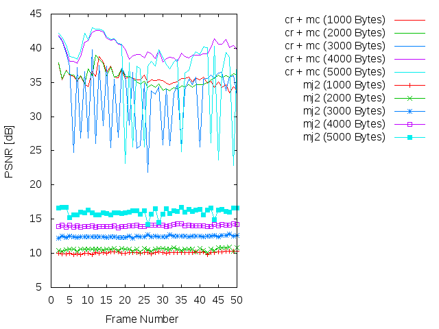
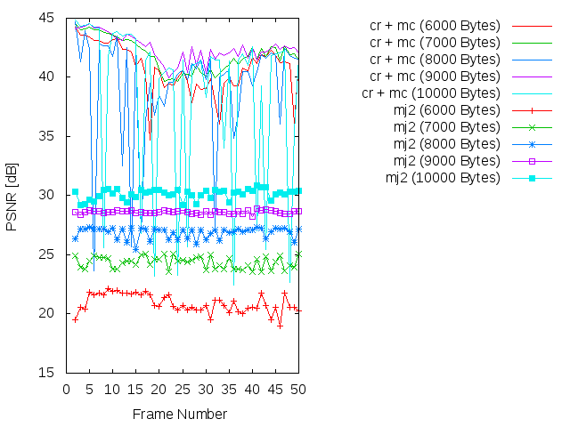
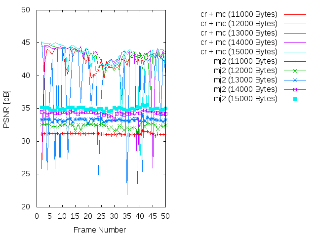
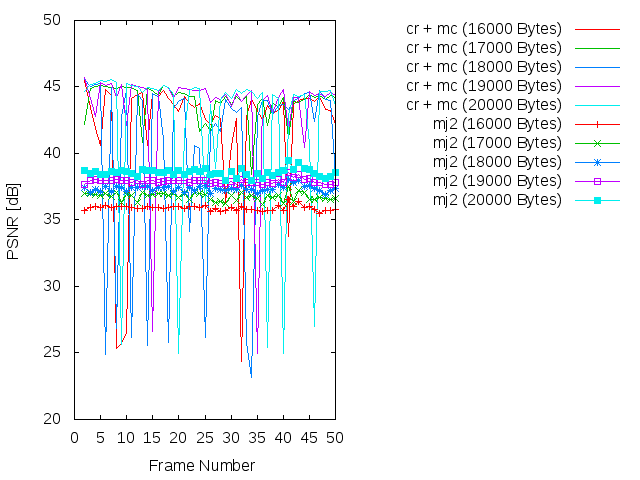
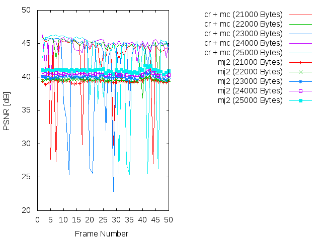
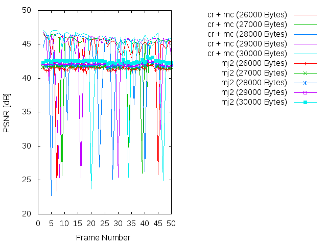
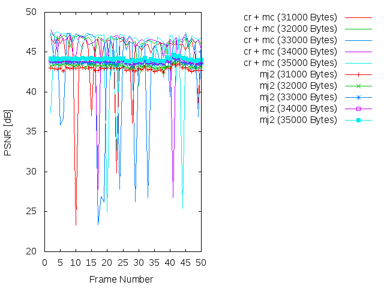
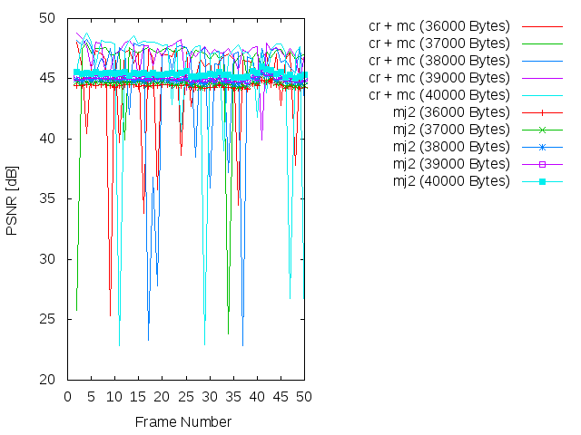

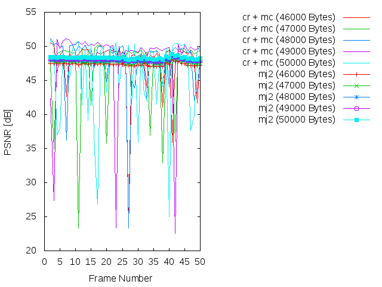

### SSIM


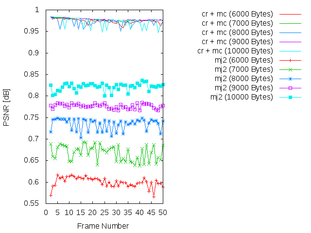
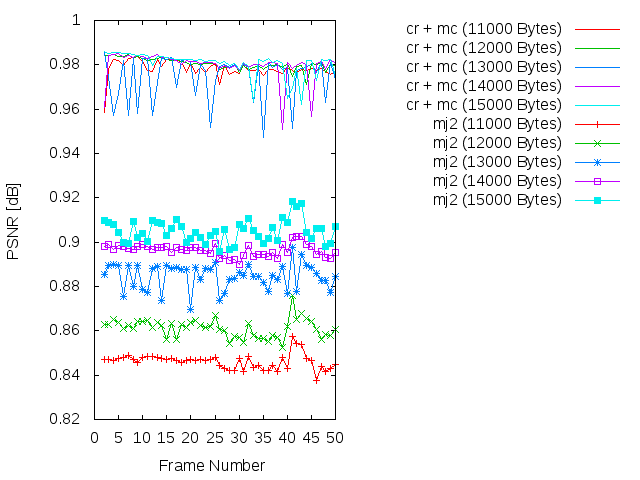
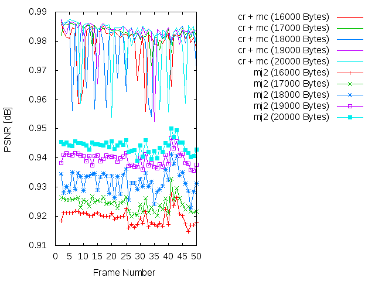

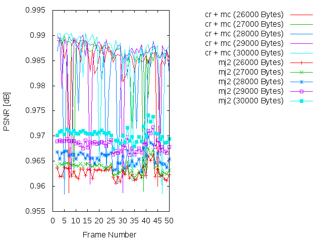
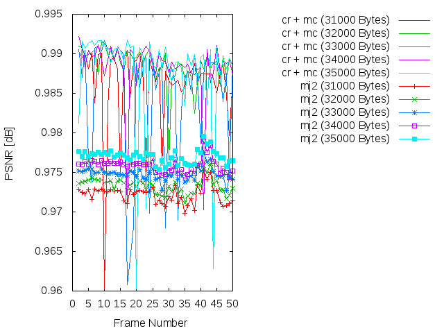
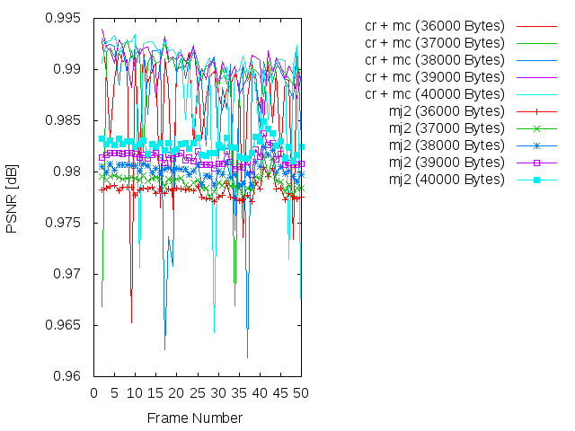
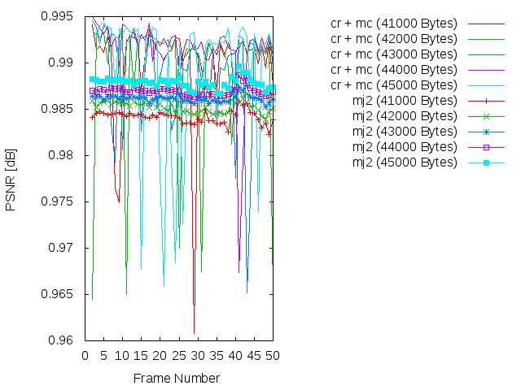
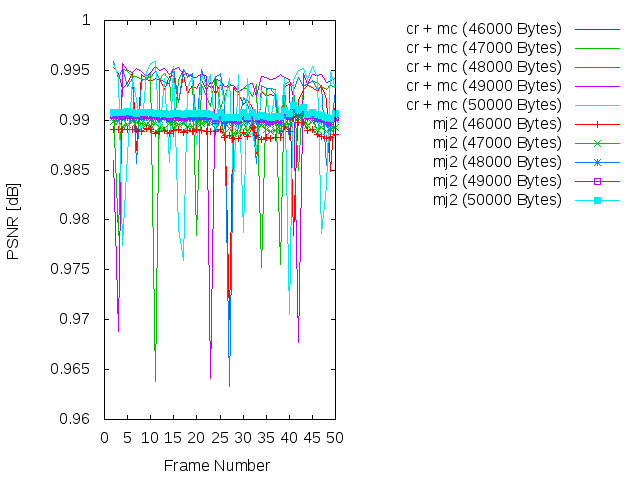

### Average

| PSNR-SSIM \ Bytes | 1000            | 2000            | 3000            | 4000            | 5000           
| ----------------- | --------------- | --------------- | --------------- | --------------- | ---------------
| **PSNR(cr + mc)** | 35.5579930204   |  35.5549187755  | 32.9755415918   | 39.8145009184   | 37.3441199592
| **PSNR(mj2)**     | 10.0874567347   |  10.5563328571  | 12.4658189592   | 14.0288638163   | 16.0065674082
| **SSIM(cr + mc)** |  0.960256326531 |  0.963603673469 |  0.952315510204 | 0.973293877551  |  0.968263673469
| **SSIM(mj2)**     |  0.378487755102 |  0.401075714286 |  0.471108163265 | 0.498961836735  |  0.523804285714

| PSNR-SSIM \ Bytes | 6000            | 7000            | 8000            | 9000            | 10000           
| ----------------- | --------------- | --------------- | --------------- | --------------- | ---------------
| **PSNR(cr + mc)** | 40.7639061633   | 41.9081698776   | 39.2752723469   | 42.4598113673   | 38.6254688163
| **PSNR(mj2)**     | 20.8996648163   | 24.3508285714   | 26.8636776735   | 28.618485551    | 30.148072449
| **SSIM(cr + mc)** |  0.974149591837 | 0.977519591837  |  0.972062040816 |  0.978347142857 |  0.972880408163
| **SSIM(mj2)**     |  0.600107142857 | 0.667637959184  |  0.734918571429 |  0.776380612245 |  0.82142

| PSNR-SSIM \ Bytes | 11000           | 12000           | 13000           | 14000           | 150000           
| ----------------- | --------------- | --------------- | --------------- | --------------- | ---------------
| **PSNR(cr + mc)** | 42.1147198367   | 42.9975038776   | 39.2353314898   | 42.3418726327   | 42.3355523878
| **PSNR(mj2)**     | 31.1575933673   | 32.3361361633   | 33.2737483673   | 34.3372327959   | 34.9886570816
| **SSIM(cr + mc)** |  0.978220408163 |  0.980527755102 |  0.974582244898 |  0.979790612245 |  0.980619795918
| **SSIM(mj2)**     |  0.846174489796 |  0.861168163265 |  0.884618571429 |  0.896388979592 |  0.905023469388

| PSNR-SSIM \ Bytes | 16000           | 17000           | 18000           | 19000           | 200000           
| ----------------- | --------------- | --------------- | --------------- | --------------- | ---------------
| **PSNR(cr + mc)** | 41.6069876327   | 43.889757551    | 40.3476328367   | 43.5631525918   | 42.2955236735
| **PSNR(mj2)**     | 35.9002292857   | 36.7578209796   | 37.3759539796   | 37.9120632245   | 38.5744710408
| **SSIM(cr + mc)** |  0.979366122449 |  0.982767755102 |  0.978406326531 |  0.982835510204 |  0.980994081633
| **SSIM(mj2)**     |  0.919695510204 |  0.924269591837 |  0.931854285714 |  0.939608163265 |  0.943971632653


```
* 21000 bytes
* PSNR(cr + mc):       42.8395625918
* PSNR(mj2):           39.342593102
* SSIM(cr + mc):       0.982369591837
* SSIM(mj2):           0.94687877551

* 22000 bytes
* PSNR(cr + mc):       44.5807972653
* PSNR(mj2):           39.6044999592
* SSIM(cr + mc):       0.984358367347
* SSIM(mj2):           0.949606326531

* 23000 bytes
* PSNR(cr + mc):       42.2545817347
* PSNR(mj2):           40.0043599796
* SSIM(cr + mc):       0.981575306122
* SSIM(mj2):           0.954000408163

* 24000 bytes
* PSNR(cr + mc):       44.7439303061
* PSNR(mj2):           40.4542535714
* SSIM(cr + mc):       0.985208979592
* SSIM(mj2):           0.958192857143

* 25000 bytes
* PSNR(cr + mc):       42.358724
* PSNR(mj2):           40.985896551
* SSIM(cr + mc):       0.982016734694
* SSIM(mj2):           0.960883673469

* 26000 bytes
* PSNR(cr + mc):       44.1040754082
* PSNR(mj2):           41.4489657143
* SSIM(cr + mc):       0.984801632653
* SSIM(mj2):           0.962731020408

* 27000 bytes
* PSNR(cr + mc):       44.4088672041
* PSNR(mj2):           41.695123449
* SSIM(cr + mc):       0.985483877551
* SSIM(mj2):           0.963849795918

* 28000 bytes
* PSNR(cr + mc):       43.1730375306
* PSNR(mj2):           41.938574449
* SSIM(cr + mc):       0.983813469388
* SSIM(mj2):           0.965700204082

* 29000 bytes
* PSNR(cr + mc):       43.7751498776
* PSNR(mj2):           42.2111251429
* SSIM(cr + mc):       0.984795102041
* SSIM(mj2):           0.968296938776

* 30000 bytes
* PSNR(cr + mc):       44.1948017959
* PSNR(mj2):           42.5064872449
* SSIM(cr + mc):       0.985796122449
* SSIM(mj2):           0.970296122449

* 31000 bytes
* PSNR(cr + mc):       44.548230898
* PSNR(mj2):           42.9191068163
* SSIM(cr + mc):       0.986180816327
* SSIM(mj2):           0.972184081633

* 32000 bytes
* PSNR(cr + mc):       46.2358076327
* PSNR(mj2):           43.2948465714
* SSIM(cr + mc):       0.988585918367
* SSIM(mj2):           0.973330612245

* 33000 bytes
* PSNR(cr + mc):       42.9068682245
* PSNR(mj2):           43.6793230408
* SSIM(cr + mc):       0.98477755102
* SSIM(mj2):           0.974815918367

* 34000 bytes
* PSNR(cr + mc):       45.5272663673
* PSNR(mj2):           43.9330147959
* SSIM(cr + mc):       0.988263469388
* SSIM(mj2):           0.975893061224

* 35000 bytes
* PSNR(cr + mc):       45.2375445918
* PSNR(mj2):           44.1398620816
* SSIM(cr + mc):       0.987780204082
* SSIM(mj2):           0.977017959184

* 36000 bytes
* PSNR(cr + mc):       44.6984517755
* PSNR(mj2):           44.4154805918
* SSIM(cr + mc):       0.986981632653
* SSIM(mj2):           0.978151836735

* 37000 bytes
* PSNR(cr + mc):       46.0458545918
* PSNR(mj2):           44.626919898
* SSIM(cr + mc):       0.98923
* SSIM(mj2):           0.979038571429

* 38000 bytes
* PSNR(cr + mc):       44.5930963673
* PSNR(mj2):           44.8873833265
* SSIM(cr + mc):       0.987490204082
* SSIM(mj2):           0.980159183673

* 39000 bytes
* PSNR(cr + mc):       47.004511898
* PSNR(mj2):           45.1570303878
* SSIM(cr + mc):       0.990429795918
* SSIM(mj2):           0.981364897959

* 40000 bytes
* PSNR(cr + mc):       45.0714879388
* PSNR(mj2):           45.4085735714
* SSIM(cr + mc):       0.988498571429
* SSIM(mj2):           0.982541428571

* 41000 bytes
* PSNR(cr + mc):       46.1992482857
* PSNR(mj2):           45.7660663265
* SSIM(cr + mc):       0.989739591837
* SSIM(mj2):           0.984154081633

* 42000 bytes
* PSNR(cr + mc):       45.1866322245
* PSNR(mj2):           46.0713522449
* SSIM(cr + mc):       0.988980816327
* SSIM(mj2):           0.985266530612

* 43000 bytes
* PSNR(cr + mc):       45.3738030612
* PSNR(mj2):           46.3318814898
* SSIM(cr + mc):       0.988955102041
* SSIM(mj2):           0.986196938776

* 44000 bytes
* PSNR(cr + mc):       47.4822210816
* PSNR(mj2):           46.6385680204
* SSIM(cr + mc):       0.991425714286
* SSIM(mj2):           0.98698

* 45000 bytes
* PSNR(cr + mc):       45.3548567143
* PSNR(mj2):           46.965562898
* SSIM(cr + mc):       0.989275306122
* SSIM(mj2):           0.987850204082

* 46000 bytes
* PSNR(cr + mc):       47.5206908776
* PSNR(mj2):           47.3638921633
* SSIM(cr + mc):       0.991928571429
* SSIM(mj2):           0.988824081633

* 47000 bytes
* PSNR(cr + mc):       47.0652878776
* PSNR(mj2):           47.6468912653
* SSIM(cr + mc):       0.991304081633
* SSIM(mj2):           0.989479795918

* 48000 bytes
* PSNR(cr + mc):       47.6445718571
* PSNR(mj2):           47.8983158367
* SSIM(cr + mc):       0.991936326531
* SSIM(mj2):           0.990113877551

* 49000 bytes
* PSNR(cr + mc):       48.108522449
* PSNR(mj2):           48.0744473265
* SSIM(cr + mc):       0.99243244898
* SSIM(mj2):           0.99034755102

* 50000 bytes
* PSNR(cr + mc):       45.6970301837
* PSNR(mj2):           48.3016742041
* SSIM(cr + mc):       0.990351020408
* SSIM(mj2):           0.990627346939

* 51000 bytes
* PSNR(cr + mc):       49.0492367347
* PSNR(mj2):           48.5057331429
* SSIM(cr + mc):       0.993573673469
* SSIM(mj2):           0.990984489796

* 52000 bytes
* PSNR(cr + mc):       46.0416064694
* PSNR(mj2):           48.752879102
* SSIM(cr + mc):       0.990913061224
* SSIM(mj2):           0.99147755102

* 53000 bytes
* PSNR(cr + mc):       50.510901
* PSNR(mj2):           49.0253193878
* SSIM(cr + mc):       0.994873877551
* SSIM(mj2):           0.991904897959

* 54000 bytes
* PSNR(cr + mc):       48.9304443469
* PSNR(mj2):           49.2815724694
* SSIM(cr + mc):       0.99338755102
* SSIM(mj2):           0.992271632653

* 55000 bytes
* PSNR(cr + mc):       50.0368318163
* PSNR(mj2):           49.5635425918
* SSIM(cr + mc):       0.994541836735
* SSIM(mj2):           0.992760408163

* 56000 bytes
* PSNR(cr + mc):       47.8565492449
* PSNR(mj2):           49.8083059796
* SSIM(cr + mc):       0.992904897959
* SSIM(mj2):           0.993194693878

* 57000 bytes
* PSNR(cr + mc):       51.0651405306
* PSNR(mj2):           50.1892457347
* SSIM(cr + mc):       0.995319795918
* SSIM(mj2):           0.993750612245

* 58000 bytes
* PSNR(cr + mc):       47.4078189184
* PSNR(mj2):           50.5505110816
* SSIM(cr + mc):       0.991960612245
* SSIM(mj2):           0.994246122449

* 59000 bytes
* PSNR(cr + mc):       51.768098551
* PSNR(mj2):           50.9960465714
* SSIM(cr + mc):       0.995953469388
* SSIM(mj2):           0.994775714286

* 60000 bytes
* PSNR(cr + mc):       48.5541862245
* PSNR(mj2):           51.3975477551
* SSIM(cr + mc):       0.993161020408
* SSIM(mj2):           0.995181836735
```

Simulación de los resultados
=============

* Bitrate: 1000 bytes. [gif](gif/all_1000.gif) | [ogv](ogv/all_1000.ogv)
* Bitrate: 2000 bytes. [gif](gif/all_2000.gif) | [ogv](ogv/all_2000.ogv)
* Bitrate: 3000 bytes. [gif](gif/all_3000.gif) | [ogv](ogv/all_3000.ogv)
* Bitrate: 4000 bytes. [gif](gif/all_4000.gif) | [ogv](ogv/all_4000.ogv)
* Bitrate: 5000 bytes. [gif](gif/all_5000.gif) | [ogv](ogv/all_5000.ogv)
* Bitrate: 6000 bytes. [gif](gif/all_6000.gif) | [ogv](ogv/all_6000.ogv)
* Bitrate: 7000 bytes. [gif](gif/all_7000.gif) | [ogv](ogv/all_7000.ogv)
* Bitrate: 8000 bytes. [gif](gif/all_8000.gif) | [ogv](ogv/all_8000.ogv)
* Bitrate: 9000 bytes. [gif](gif/all_9000.gif) | [ogv](ogv/all_9000.ogv)
* Bitrate: 10000 bytes. [gif](gif/all_10000.gif) | [ogv](ogv/all_10000.ogv)
* Bitrate: 11000 bytes. [gif](gif/all_11000.gif) | [ogv](ogv/all_11000.ogv)
* Bitrate: 12000 bytes. [gif](gif/all_12000.gif) | [ogv](ogv/all_12000.ogv)
* Bitrate: 13000 bytes. [gif](gif/all_13000.gif) | [ogv](ogv/all_13000.ogv)
* Bitrate: 14000 bytes. [gif](gif/all_14000.gif) | [ogv](ogv/all_14000.ogv)
* Bitrate: 15000 bytes. [gif](gif/all_15000.gif) | [ogv](ogv/all_15000.ogv)
* Bitrate: 16000 bytes. [gif](gif/all_16000.gif) | [ogv](ogv/all_16000.ogv)
* Bitrate: 17000 bytes. [gif](gif/all_17000.gif) | [ogv](ogv/all_17000.ogv)
* Bitrate: 18000 bytes. [gif](gif/all_18000.gif) | [ogv](ogv/all_18000.ogv)
* Bitrate: 19000 bytes. [gif](gif/all_19000.gif) | [ogv](ogv/all_19000.ogv)
* Bitrate: 20000 bytes. [gif](gif/all_20000.gif) | [ogv](ogv/all_20000.ogv)
* Bitrate: 21000 bytes. [gif](gif/all_21000.gif) | [ogv](ogv/all_21000.ogv)
* Bitrate: 22000 bytes. [gif](gif/all_22000.gif) | [ogv](ogv/all_22000.ogv)
* Bitrate: 23000 bytes. [gif](gif/all_23000.gif) | [ogv](ogv/all_23000.ogv)
* Bitrate: 24000 bytes. [gif](gif/all_24000.gif) | [ogv](ogv/all_24000.ogv)
* Bitrate: 25000 bytes. [gif](gif/all_25000.gif) | [ogv](ogv/all_25000.ogv)
* Bitrate: 26000 bytes. [gif](gif/all_26000.gif) | [ogv](ogv/all_26000.ogv)
* Bitrate: 27000 bytes. [gif](gif/all_27000.gif) | [ogv](ogv/all_27000.ogv)
* Bitrate: 28000 bytes. [gif](gif/all_28000.gif) | [ogv](ogv/all_28000.ogv)
* Bitrate: 29000 bytes. [gif](gif/all_29000.gif) | [ogv](ogv/all_29000.ogv)
* Bitrate: 30000 bytes. [gif](gif/all_30000.gif) | [ogv](ogv/all_30000.ogv)
* Bitrate: 31000 bytes. [gif](gif/all_31000.gif) | [ogv](ogv/all_31000.ogv)
* Bitrate: 32000 bytes. [gif](gif/all_32000.gif) | [ogv](ogv/all_32000.ogv)
* Bitrate: 33000 bytes. [gif](gif/all_33000.gif) | [ogv](ogv/all_33000.ogv)
* Bitrate: 34000 bytes. [gif](gif/all_34000.gif) | [ogv](ogv/all_34000.ogv)
* Bitrate: 35000 bytes. [gif](gif/all_35000.gif) | [ogv](ogv/all_35000.ogv)
* Bitrate: 36000 bytes. [gif](gif/all_36000.gif) | [ogv](ogv/all_36000.ogv)
* Bitrate: 37000 bytes. [gif](gif/all_37000.gif) | [ogv](ogv/all_37000.ogv)
* Bitrate: 31000 bytes. [gif](gif/all_38000.gif) | [ogv](ogv/all_38000.ogv)
* Bitrate: 39000 bytes. [gif](gif/all_39000.gif) | [ogv](ogv/all_39000.ogv)
* Bitrate: 40000 bytes. [gif](gif/all_40000.gif) | [ogv](ogv/all_40000.ogv)
* Bitrate: 41000 bytes. [gif](gif/all_41000.gif) | [ogv](ogv/all_41000.ogv)
* Bitrate: 42000 bytes. [gif](gif/all_42000.gif) | [ogv](ogv/all_42000.ogv)
* Bitrate: 43000 bytes. [gif](gif/all_43000.gif) | [ogv](ogv/all_43000.ogv)
* Bitrate: 44000 bytes. [gif](gif/all_44000.gif) | [ogv](ogv/all_44000.ogv)
* Bitrate: 45000 bytes. [gif](gif/all_45000.gif) | [ogv](ogv/all_45000.ogv)
* Bitrate: 46000 bytes. [gif](gif/all_46000.gif) | [ogv](ogv/all_41000.ogv)
* Bitrate: 47000 bytes. [gif](gif/all_47000.gif) | [ogv](ogv/all_47000.ogv)
* Bitrate: 48000 bytes. [gif](gif/all_48000.gif) | [ogv](ogv/all_48000.ogv)
* Bitrate: 49000 bytes. [gif](gif/all_49000.gif) | [ogv](ogv/all_49000.ogv)
* Bitrate: 50000 bytes. [gif](gif/all_50000.gif) | [ogv](ogv/all_50000.ogv)
* Bitrate: 41000 bytes. [gif](gif/all_51000.gif) | [ogv](ogv/all_51000.ogv)
* Bitrate: 42000 bytes. [gif](gif/all_52000.gif) | [ogv](ogv/all_52000.ogv)
* Bitrate: 43000 bytes. [gif](gif/all_53000.gif) | [ogv](ogv/all_53000.ogv)
* Bitrate: 44000 bytes. [gif](gif/all_54000.gif) | [ogv](ogv/all_54000.ogv)
* Bitrate: 45000 bytes. [gif](gif/all_55000.gif) | [ogv](ogv/all_55000.ogv)
* Bitrate: 46000 bytes. [gif](gif/all_56000.gif) | [ogv](ogv/all_51000.ogv)
* Bitrate: 47000 bytes. [gif](gif/all_57000.gif) | [ogv](ogv/all_57000.ogv)
* Bitrate: 48000 bytes. [gif](gif/all_58000.gif) | [ogv](ogv/all_58000.ogv)
* Bitrate: 49000 bytes. [gif](gif/all_59000.gif) | [ogv](ogv/all_59000.ogv)
* Bitrate: 60000 bytes. [gif](gif/all_60000.gif) | [ogv](ogv/all_60000.ogv)