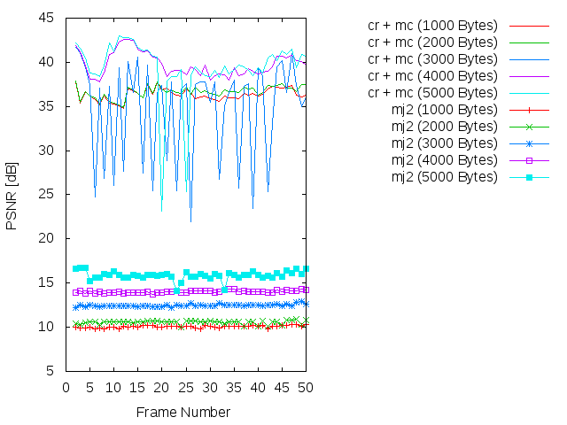
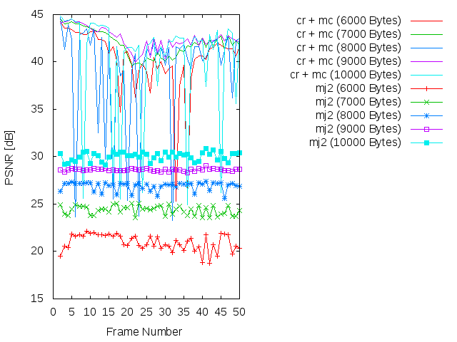
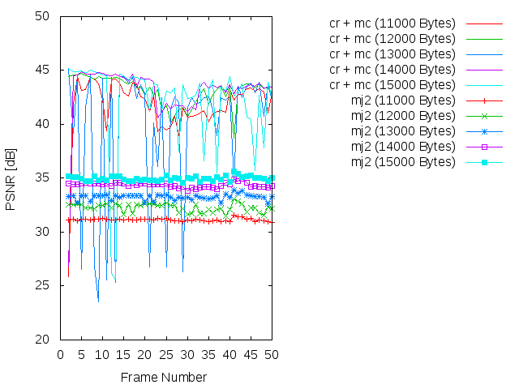
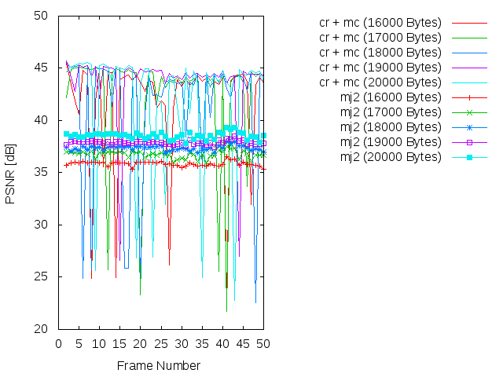
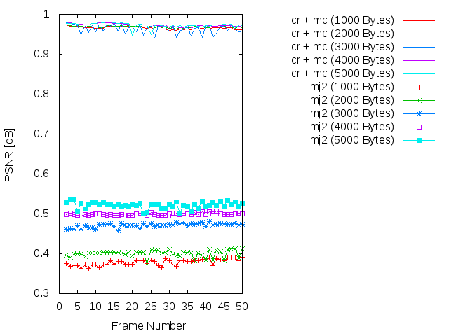
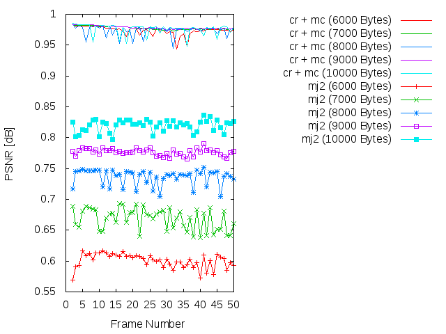
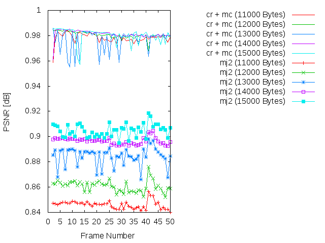
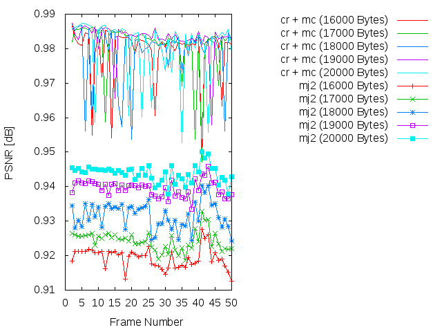

Experiment: 2015-03-05
======================

### Secuencia

- *speedway*
- Número de imágenes: **50**

### Información de la secuencia
* ~~Parámetros para la estimación de movimiento~~

* Parámetros de **kdu_compress**:

```
    CLAYERS=20
    CLEVELS=2
    CPRECINCTS="{64,64},{32,32},{16,16}"
    CBLK="{16,16}"
```

* Layer size (in bytes):

```
    Resolution level: 0
    Layer: 1     Size: 1,198
    Layer: 2     Size: 1,858
    Layer: 3     Size: 2,522
    Layer: 4     Size: 3,204
    Layer: 5     Size: 3,903
    Layer: 6     Size: 4,629
    Layer: 7     Size: 5,393
    Layer: 8     Size: 6,217
    Layer: 9     Size: 7,119
    Layer: 10    Size: 8,127
    Layer: 11    Size: 9,317
    Layer: 12    Size: 10,719
    Layer: 13    Size: 12,428
    Layer: 14    Size: 14,627
    Layer: 15    Size: 17,446
    Layer: 16    Size: 21,173
    Layer: 17    Size: 26,161
    Layer: 18    Size: 32,943
    Layer: 19    Size: 42,343
    Layer: 20    Size: 69,159
```

### Descripción

- Este experimento compara cómo sería la transmisión siguiendo el algoritmo
  **cr** frente a una transmisión Motion JPEG2000 (**mj2**). 
- La transmisión Motion JPEG2000 se simula truncando el *code-stream* a
  un determinado bitrate.
- La transmisión **cr** utiliza los siguientes parámetros:
    - WoisToCache: Modo 2 / Enviando 20 capas completas para precinto
    - Utiliza Knapsack: No
    - ~~Utiliza **mc**: No~~
    - Bitrate estimado: De **1000 bytes** a **48000 bytes**

PSNR and SSIM
=============

### PSNR






### SSIM






### Average

| PSNR-SSIM \ Bytes | 1000            | 2000            | 3000            | 4000            | 5000           
| ----------------- | --------------- | --------------- | --------------- | --------------- | ---------------
| **PSNR(cr + mc)** | 36.3398249184   | 36.6576889592   | 34.6794325306   | 39.7579894082   | 39.4354591837
| **PSNR(mj2)**     | 10.0751921224   | 10.5604436327   | 12.4693245918   | 14.0288638163   | 15.8629045714
| **SSIM(cr + mc)** |  0.965806734694 |  0.968771836735 |  0.963499795918 |  0.973110612245 |  0.972930204082
| **SSIM(mj2)**     |  0.37804244898  |  0.40054244898  |  0.471263061224 |  0.498961836735 |  0.521500408163

| PSNR-SSIM \ Bytes | 6000            | 7000            | 8000            | 9000            | 10000           
| ----------------- | --------------- | --------------- | --------------- | --------------- | ---------------
| **PSNR(cr + mc)** | 40.202409102    | 41.9616324694   | 39.2028065918   | 42.4748200204   | 40.2860019184
| **PSNR(mj2)**     | 20.9727863673   | 24.3684172449   | 26.8974915102   | 28.6205553265   | 30.0588648571
| **SSIM(cr + mc)** |  0.973426938776 |  0.977626938776 |  0.973586122449 |  0.978384285714 |  0.975870816327
| **SSIM(mj2)**     |  0.600548979592 |  0.668136326531 |  0.736249387755 |  0.77642        |  0.81963244898

| PSNR-SSIM \ Bytes | 11000           | 12000           | 13000           | 14000           | 150000           
| ----------------- | --------------- | --------------- | --------------- | --------------- | ---------------
| **PSNR(cr + mc)** | 41.7674872653   | 43.1063236327   | 39.681334102    | 43.114660102    | 42.1712752857
| **PSNR(mj2)**     | 31.1496571633   | 32.2825005918   | 33.2639552041   | 34.3778850612   | 34.9825454286
| **SSIM(cr + mc)** |  0.978122653061 |  0.980614897959 |  0.976351428571 |  0.981194081633 | 0.980115510204
| **SSIM(mj2)**     |  0.846050204082 |  0.86074755102  |  0.88448122449  |  0.896607959184 | 0.904911428571

| PSNR-SSIM \ Bytes | 16000           | 17000           | 18000           | 19000           | 200000           
| ----------------- | --------------- | --------------- | --------------- | --------------- | ---------------
| **PSNR(cr + mc)** | 41.6402931224   | 42.186553102    | 41.2859366531   | 43.7549911429   | 42.0191447959
| **PSNR(mj2)**     | 35.8670650612   | 36.765326102    | 37.3674301429   | 37.9035529592   | 38.5557825714
| **SSIM(cr + mc)** |  0.979339387755 | 0.980355102041  | 0.979385714286  |  0.983017346939 |  0.98056244898
| **SSIM(mj2)**     |  0.919326734694 | 0.924284489796  | 0.931654285714  |  0.939506938776 |  0.943842040816

Simulación de los resultados
=============

* Bitrate: 1000 bytes. [gif](gif/all_1000.gif) | [ogv](ogv/all_1000.ogv)
* Bitrate: 2000 bytes. [gif](gif/all_2000.gif) | [ogv](ogv/all_2000.ogv)
* Bitrate: 3000 bytes. [gif](gif/all_3000.gif) | [ogv](ogv/all_3000.ogv)
* Bitrate: 4000 bytes. [gif](gif/all_4000.gif) | [ogv](ogv/all_4000.ogv)
* Bitrate: 5000 bytes. [gif](gif/all_5000.gif) | [ogv](ogv/all_5000.ogv)
* Bitrate: 6000 bytes. [gif](gif/all_6000.gif) | [ogv](ogv/all_6000.ogv)
* Bitrate: 7000 bytes. [gif](gif/all_7000.gif) | [ogv](ogv/all_7000.ogv)
* Bitrate: 8000 bytes. [gif](gif/all_8000.gif) | [ogv](ogv/all_8000.ogv)
* Bitrate: 9000 bytes. [gif](gif/all_9000.gif) | [ogv](ogv/all_9000.ogv)
* Bitrate: 10000 bytes. [gif](gif/all_10000.gif) | [ogv](ogv/all_10000.ogv)
* Bitrate: 11000 bytes. [gif](gif/all_11000.gif) | [ogv](ogv/all_11000.ogv)
* Bitrate: 12000 bytes. [gif](gif/all_12000.gif) | [ogv](ogv/all_12000.ogv)
* Bitrate: 13000 bytes. [gif](gif/all_13000.gif) | [ogv](ogv/all_13000.ogv)
* Bitrate: 14000 bytes. [gif](gif/all_14000.gif) | [ogv](ogv/all_14000.ogv)
* Bitrate: 15000 bytes. [gif](gif/all_15000.gif) | [ogv](ogv/all_15000.ogv)
* Bitrate: 16000 bytes. [gif](gif/all_16000.gif) | [ogv](ogv/all_16000.ogv)
* Bitrate: 17000 bytes. [gif](gif/all_17000.gif) | [ogv](ogv/all_17000.ogv)
* Bitrate: 18000 bytes. [gif](gif/all_18000.gif) | [ogv](ogv/all_18000.ogv)
* Bitrate: 19000 bytes. [gif](gif/all_19000.gif) | [ogv](ogv/all_19000.ogv)
* Bitrate: 20000 bytes. [gif](gif/all_20000.gif) | [ogv](ogv/all_20000.ogv)