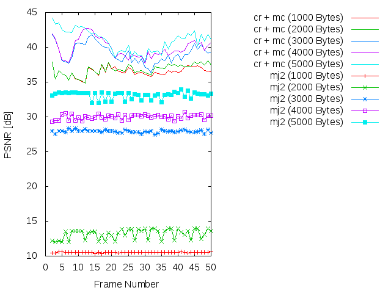
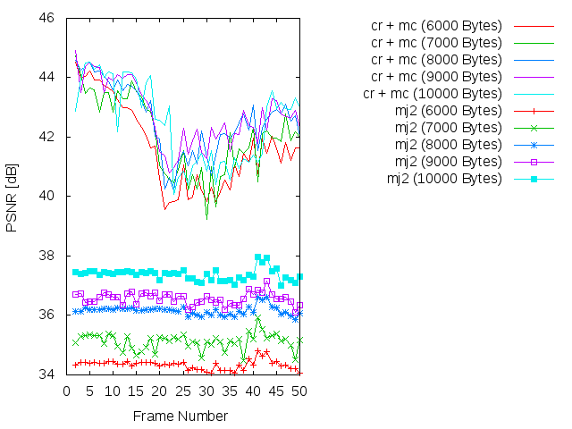
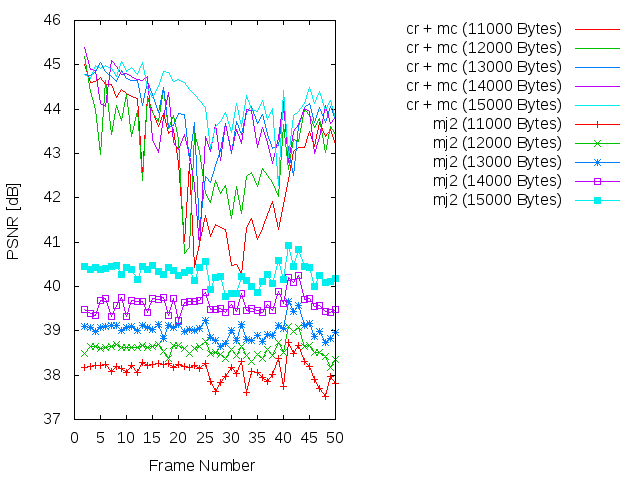
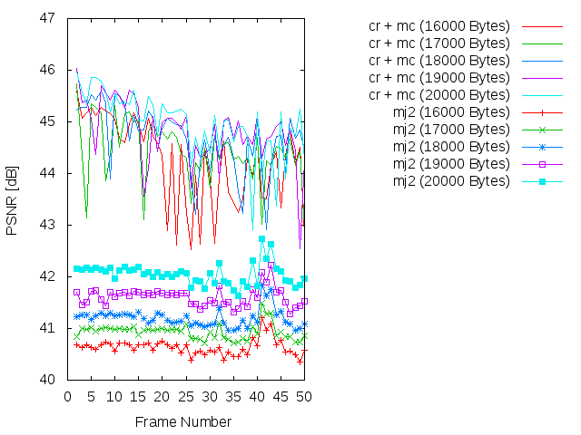
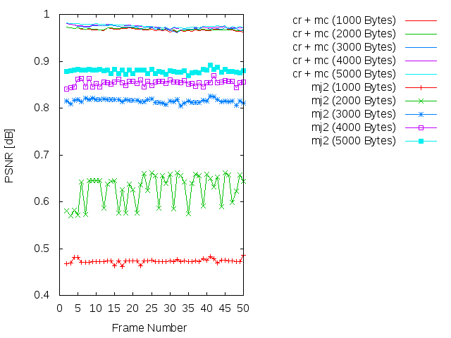
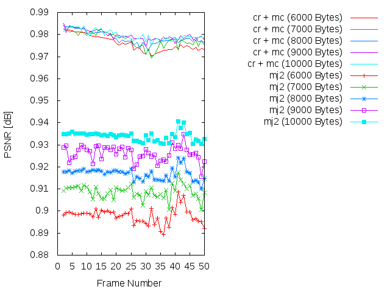
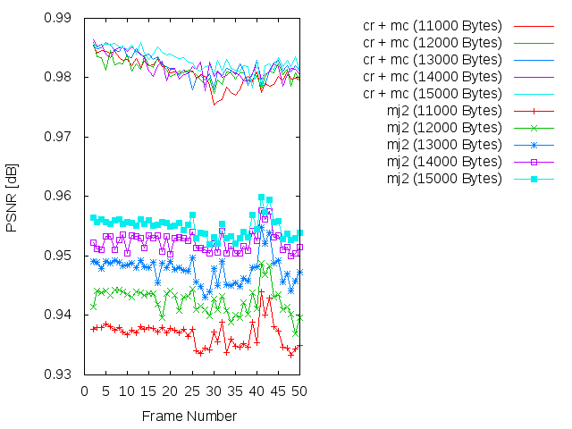
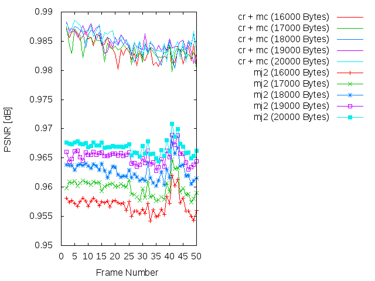

Experiment: 2015-03-05
======================

### Secuencia

- *speedway*
- Número de imágenes: **50**

### Información de la secuencia
* ~~Parámetros para la estimación de movimiento~~

* Parámetros de **kdu_compress**:

```
    CLAYERS=8
    CLEVELS=2
    CPRECINCTS="{64,64},{32,32},{16,16}"
    CBLK="{16,16}"
```

* Layer size (in bytes):

```
    Resolution level: 0
    Layer: 1     Size: 5,354
    Layer: 2     Size: 7,830
    Layer: 3     Size: 11,050
    Layer: 4     Size: 15,336
    Layer: 5     Size: 21,136
    Layer: 6     Size: 29,117
    Layer: 7     Size: 40,119
    Layer: 8     Size: 61,655
```

### Descripción

- Este experimento compara cómo sería la transmisión siguiendo el algoritmo
  **cr** frente a una transmisión Motion JPEG2000 (**mj2**). 
- La transmisión Motion JPEG2000 se simula truncando el *code-stream* a
  un determinado bitrate.
- La transmisión **cr** utiliza los siguientes parámetros:
    - WoisToCache: Modo 2 / Enviando 8 capas completas para precinto
    - Utiliza Knapsack: No
    - Utiliza **mc**: No
    - Bitrate estimado: De **1000 bytes** a **20000 bytes**

PSNR and SSIM
=============

### PSNR






### SSIM






### Average

| PSNR-SSIM \ Bytes | 1000            | 2000            | 3000            | 4000            | 5000           
| ----------------- | --------------- | --------------- | --------------- | --------------- | ---------------
| **PSNR(cr + mc)** |  
| **PSNR(mj2)**     |  
| **SSIM(cr + mc)** |  
| **SSIM(mj2)**     |  

| PSNR-SSIM \ Bytes | 6000            | 7000            | 8000            | 9000            | 10000           
| ----------------- | --------------- | --------------- | --------------- | --------------- | ---------------
| **PSNR(cr + mc)** |  
| **PSNR(mj2)**     |  
| **SSIM(cr + mc)** |  
| **SSIM(mj2)**     |  

| PSNR-SSIM \ Bytes | 11000           | 12000           | 13000           | 14000           | 150000           
| ----------------- | --------------- | --------------- | --------------- | --------------- | ---------------
| **PSNR(cr + mc)** |  
| **PSNR(mj2)**     |  
| **SSIM(cr + mc)** |  
| **SSIM(mj2)**     |  

| PSNR-SSIM \ Bytes | 16000           | 17000           | 18000           | 19000           | 200000           
| ----------------- | --------------- | --------------- | --------------- | --------------- | ---------------
| **PSNR(cr + mc)** |  
| **PSNR(mj2)**     |  
| **SSIM(cr + mc)** |  
| **SSIM(mj2)**     |  

Simulación de los resultados
=============

* Bitrate: 1000 bytes. [gif](gif/all_1000.gif) | [ogv](ogv/all_1000.ogv)
* Bitrate: 2000 bytes. [gif](gif/all_2000.gif) | [ogv](ogv/all_2000.ogv)
* Bitrate: 3000 bytes. [gif](gif/all_3000.gif) | [ogv](ogv/all_3000.ogv)
* Bitrate: 4000 bytes. [gif](gif/all_4000.gif) | [ogv](ogv/all_4000.ogv)
* Bitrate: 5000 bytes. [gif](gif/all_5000.gif) | [ogv](ogv/all_5000.ogv)
* Bitrate: 6000 bytes. [gif](gif/all_6000.gif) | [ogv](ogv/all_6000.ogv)
* Bitrate: 7000 bytes. [gif](gif/all_7000.gif) | [ogv](ogv/all_7000.ogv)
* Bitrate: 8000 bytes. [gif](gif/all_8000.gif) | [ogv](ogv/all_8000.ogv)
* Bitrate: 9000 bytes. [gif](gif/all_9000.gif) | [ogv](ogv/all_9000.ogv)
* Bitrate: 10000 bytes. [gif](gif/all_10000.gif) | [ogv](ogv/all_10000.ogv)
* Bitrate: 11000 bytes. [gif](gif/all_11000.gif) | [ogv](ogv/all_11000.ogv)
* Bitrate: 12000 bytes. [gif](gif/all_12000.gif) | [ogv](ogv/all_12000.ogv)
* Bitrate: 13000 bytes. [gif](gif/all_13000.gif) | [ogv](ogv/all_13000.ogv)
* Bitrate: 14000 bytes. [gif](gif/all_14000.gif) | [ogv](ogv/all_14000.ogv)
* Bitrate: 15000 bytes. [gif](gif/all_15000.gif) | [ogv](ogv/all_15000.ogv)
* Bitrate: 16000 bytes. [gif](gif/all_16000.gif) | [ogv](ogv/all_16000.ogv)
* Bitrate: 17000 bytes. [gif](gif/all_17000.gif) | [ogv](ogv/all_17000.ogv)
* Bitrate: 18000 bytes. [gif](gif/all_18000.gif) | [ogv](ogv/all_18000.ogv)
* Bitrate: 19000 bytes. [gif](gif/all_19000.gif) | [ogv](ogv/all_19000.ogv)
* Bitrate: 20000 bytes. [gif](gif/all_20000.gif) | [ogv](ogv/all_20000.ogv)