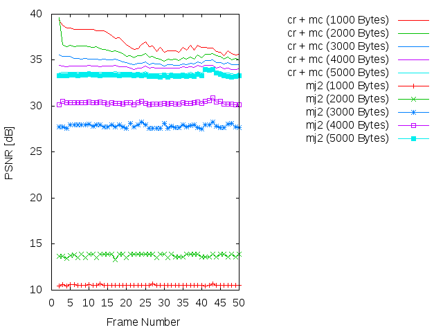
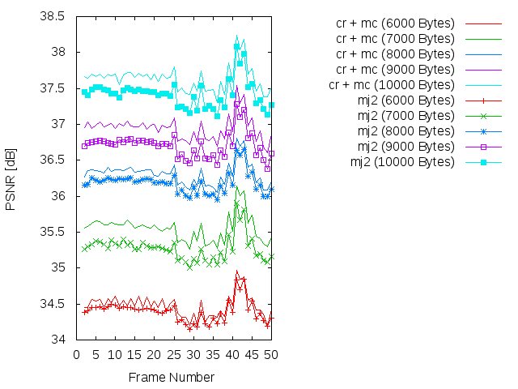
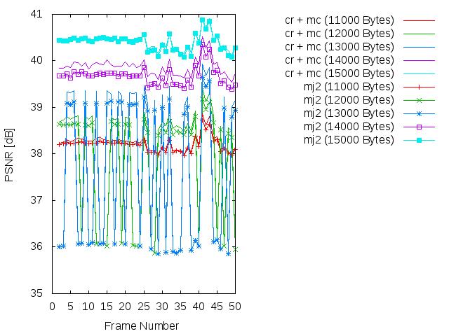
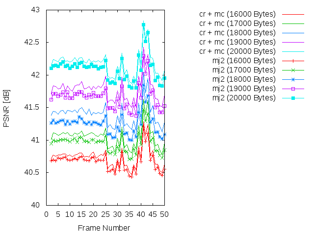
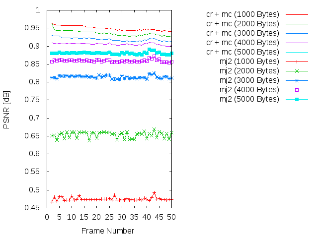
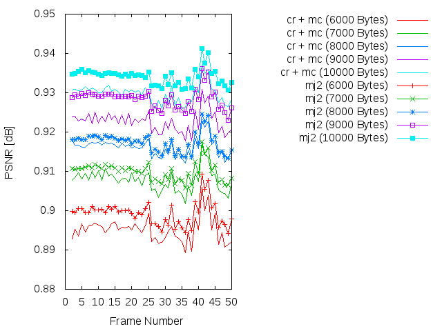
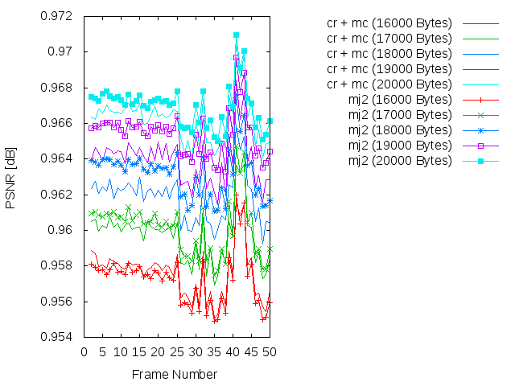

Experiment: 2015-03-06
======================

### Secuencia

- *speedway*
- Número de imágenes: **50**

### Información de la secuencia
* ~~Parámetros para la estimación de movimiento~~

* Parámetros de **kdu_compress**:

```
    CLAYERS=8
    CLEVELS=2
    CPRECINCTS="{64,64},{32,32},{16,16}"
    CBLK="{16,16}"
```

* Layer size (in bytes):

```
    Resolution level: 0
    Layer: 1     Size: 5,354
    Layer: 2     Size: 7,830
    Layer: 3     Size: 11,050
    Layer: 4     Size: 15,336
    Layer: 5     Size: 21,136
    Layer: 6     Size: 29,117
    Layer: 7     Size: 40,119
    Layer: 8     Size: 61,655
```

### Descripción

- Este experimento compara cómo sería la transmisión siguiendo el algoritmo
  **cr** frente a una transmisión Motion JPEG2000 (**mj2**). 
- La transmisión Motion JPEG2000 se simula truncando el *code-stream* a
  un determinado bitrate.
- La transmisión **cr** utiliza los siguientes parámetros:
    - WoisToCache: Modo AUTO
    - Utiliza Knapsack: Sí
    - Utiliza **mc**: No
    - Bitrate estimado: De **1000 bytes** a **20000 bytes**

PSNR and SSIM
=============

### PSNR






### SSIM






### Average

| PSNR-SSIM \ Bytes | 1000            | 2000            | 3000            | 4000            | 5000           
| ----------------- | --------------- | --------------- | --------------- | --------------- | ---------------
| **PSNR(cr + mc)** |
| **PSNR(mj2)**     |
| **SSIM(cr + mc)** |
| **SSIM(mj2)**     |

| PSNR-SSIM \ Bytes | 6000            | 7000            | 8000            | 9000            | 10000           
| ----------------- | --------------- | --------------- | --------------- | --------------- | ---------------
| **PSNR(cr + mc)** |
| **PSNR(mj2)**     |
| **SSIM(cr + mc)** |
| **SSIM(mj2)**     |

| PSNR-SSIM \ Bytes | 11000           | 12000           | 13000           | 14000           | 150000           
| ----------------- | --------------- | --------------- | --------------- | --------------- | ---------------
| **PSNR(cr + mc)** |
| **PSNR(mj2)**     |
| **SSIM(cr + mc)** |
| **SSIM(mj2)**     |

| PSNR-SSIM \ Bytes | 16000           | 17000           | 18000           | 19000           | 200000           
| ----------------- | --------------- | --------------- | --------------- | --------------- | ---------------
| **PSNR(cr + mc)** |
| **PSNR(mj2)**     |
| **SSIM(cr + mc)** |
| **SSIM(mj2)**     |

```
* 1000 bytes
* PSNR(cr + mc):       36.9237178776
* PSNR(mj2):           10.5454178163
* SSIM(cr + mc):       0.949574081633
* SSIM(mj2):           0.474845714286

* 2000 bytes
* PSNR(cr + mc):       35.7415939184
* PSNR(mj2):           13.7731803878
* SSIM(cr + mc):       0.935323673469
* SSIM(mj2):           0.653447755102

* 3000 bytes
* PSNR(cr + mc):       34.8272437959
* PSNR(mj2):           27.8408602041
* SSIM(cr + mc):       0.918752040816
* SSIM(mj2):           0.814161020408

* 4000 bytes
* PSNR(cr + mc):       34.2517191224
* PSNR(mj2):           30.3414370612
* SSIM(cr + mc):       0.905315102041
* SSIM(mj2):           0.85930244898

* 5000 bytes
* PSNR(cr + mc):       33.6595696327
* PSNR(mj2):           33.3608283265
* SSIM(cr + mc):       0.883591836735
* SSIM(mj2):           0.880386326531

* 6000 bytes
* PSNR(cr + mc):       34.4791887347
* PSNR(mj2):           34.3956826327
* SSIM(cr + mc):       0.89510877551
* SSIM(mj2):           0.899270816327

* 7000 bytes
* PSNR(cr + mc):       35.5520880816
* PSNR(mj2):           35.2749598367
* SSIM(cr + mc):       0.907673265306
* SSIM(mj2):           0.909979183673

* 8000 bytes
* PSNR(cr + mc):       36.3128488776
* PSNR(mj2):           36.1868117551
* SSIM(cr + mc):       0.916135714286
* SSIM(mj2):           0.917414897959

* 9000 bytes
* PSNR(cr + mc):       36.9478619592
* PSNR(mj2):           36.7107395714
* SSIM(cr + mc):       0.922630816327
* SSIM(mj2):           0.928443877551

* 10000 bytes
* PSNR(cr + mc):       37.6370803673
* PSNR(mj2):           37.4214625306
* SSIM(cr + mc):       0.929858163265
* SSIM(mj2):           0.934184081633

* 11000 bytes
* PSNR(cr + mc):       38.2510625306
* PSNR(mj2):           38.197822551
* SSIM(cr + mc):       0.937589795918
* SSIM(mj2):           0.937301020408

* 12000 bytes
* PSNR(cr + mc):       37.9157519592
* PSNR(mj2):           37.8255881837
* SSIM(cr + mc):       0.933298979592
* SSIM(mj2):           0.933965714286

* 13000 bytes
* PSNR(cr + mc):       37.7067495918
* PSNR(mj2):           37.5890364694
* SSIM(cr + mc):       0.930267142857
* SSIM(mj2):           0.931267346939

* 14000 bytes
* PSNR(cr + mc):       39.875020102
* PSNR(mj2):           39.6711894286
* SSIM(cr + mc):       0.950782857143
* SSIM(mj2):           0.952785510204

* 15000 bytes
* PSNR(cr + mc):       40.4256711633
* PSNR(mj2):           40.3954442041
* SSIM(cr + mc):       0.955343265306
* SSIM(mj2):           0.955395918367

* 16000 bytes
* PSNR(cr + mc):       40.7382881633
* PSNR(mj2):           40.6746881224
* SSIM(cr + mc):       0.957590612245
* SSIM(mj2):           0.957221020408

* 17000 bytes
* PSNR(cr + mc):       41.0551327347
* PSNR(mj2):           40.9601809388
* SSIM(cr + mc):       0.959655918367
* SSIM(mj2):           0.96014244898

* 18000 bytes
* PSNR(cr + mc):       41.3998854694
* PSNR(mj2):           41.2446363469
* SSIM(cr + mc):       0.961810204082
* SSIM(mj2):           0.963205102041

* 19000 bytes
* PSNR(cr + mc):       41.781199551
* PSNR(mj2):           41.6609606122
* SSIM(cr + mc):       0.963936938776
* SSIM(mj2):           0.965421428571

* 20000 bytes
* PSNR(cr + mc):       42.1797485306
* PSNR(mj2):           42.0968534286
* SSIM(cr + mc):       0.966215714286
* SSIM(mj2):           0.966984285714
```

Simulación de los resultados
=============

* Bitrate: 1000 bytes. [gif](gif/all_1000.gif) | [ogv](ogv/all_1000.ogv)
* Bitrate: 2000 bytes. [gif](gif/all_2000.gif) | [ogv](ogv/all_2000.ogv)
* Bitrate: 3000 bytes. [gif](gif/all_3000.gif) | [ogv](ogv/all_3000.ogv)
* Bitrate: 4000 bytes. [gif](gif/all_4000.gif) | [ogv](ogv/all_4000.ogv)
* Bitrate: 5000 bytes. [gif](gif/all_5000.gif) | [ogv](ogv/all_5000.ogv)
* Bitrate: 6000 bytes. [gif](gif/all_6000.gif) | [ogv](ogv/all_6000.ogv)
* Bitrate: 7000 bytes. [gif](gif/all_7000.gif) | [ogv](ogv/all_7000.ogv)
* Bitrate: 8000 bytes. [gif](gif/all_8000.gif) | [ogv](ogv/all_8000.ogv)
* Bitrate: 9000 bytes. [gif](gif/all_9000.gif) | [ogv](ogv/all_9000.ogv)
* Bitrate: 10000 bytes. [gif](gif/all_10000.gif) | [ogv](ogv/all_10000.ogv)
* Bitrate: 11000 bytes. [gif](gif/all_11000.gif) | [ogv](ogv/all_11000.ogv)
* Bitrate: 12000 bytes. [gif](gif/all_12000.gif) | [ogv](ogv/all_12000.ogv)
* Bitrate: 13000 bytes. [gif](gif/all_13000.gif) | [ogv](ogv/all_13000.ogv)
* Bitrate: 14000 bytes. [gif](gif/all_14000.gif) | [ogv](ogv/all_14000.ogv)
* Bitrate: 15000 bytes. [gif](gif/all_15000.gif) | [ogv](ogv/all_15000.ogv)
* Bitrate: 16000 bytes. [gif](gif/all_16000.gif) | [ogv](ogv/all_16000.ogv)
* Bitrate: 17000 bytes. [gif](gif/all_17000.gif) | [ogv](ogv/all_17000.ogv)
* Bitrate: 18000 bytes. [gif](gif/all_18000.gif) | [ogv](ogv/all_18000.ogv)
* Bitrate: 19000 bytes. [gif](gif/all_19000.gif) | [ogv](ogv/all_19000.ogv)
* Bitrate: 20000 bytes. [gif](gif/all_20000.gif) | [ogv](ogv/all_20000.ogv)