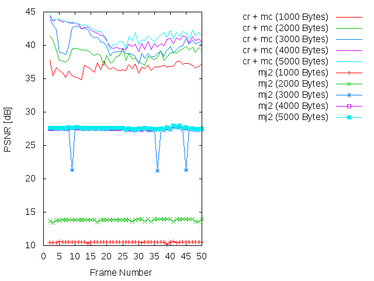
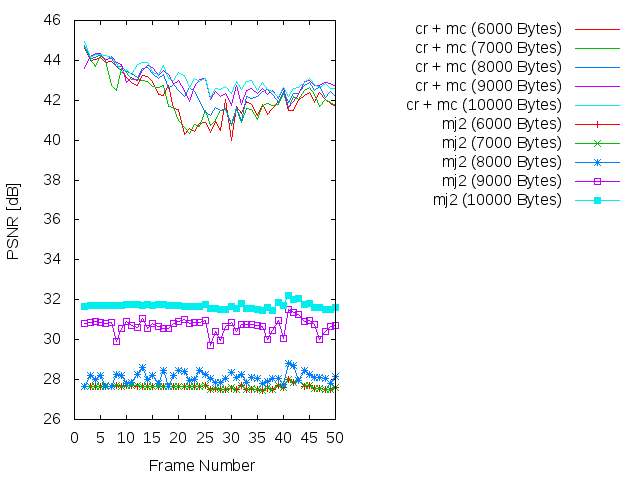
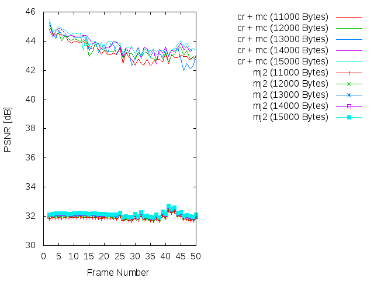
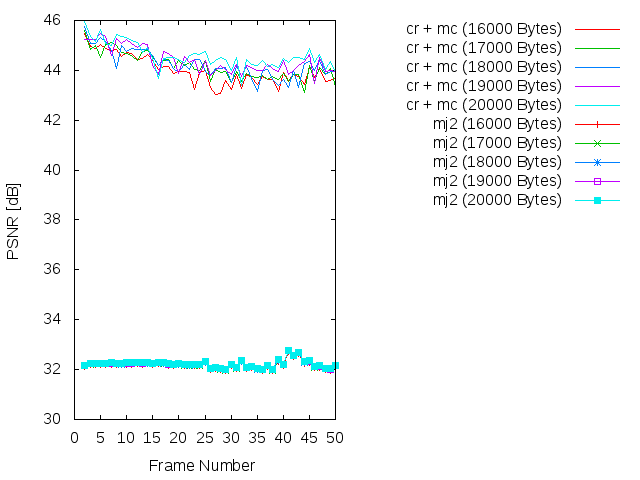
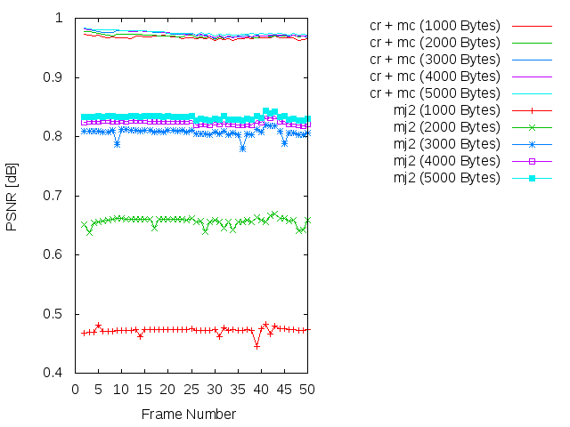
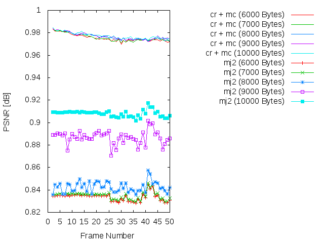
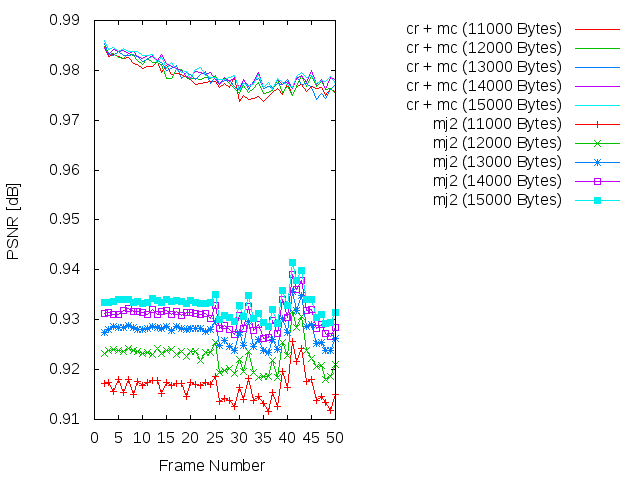
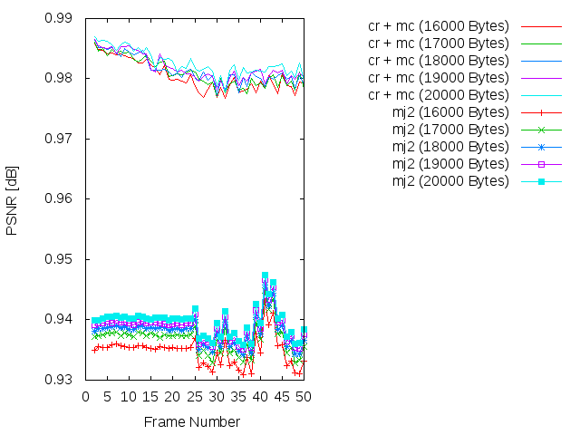

Experiment: 2015-03-11
======================

### Secuencia

- *speedway*
- Número de imágenes: **50**

### Información de la secuencia
* ~~Parámetros para la estimación de movimiento~~

* Parámetros de **kdu_compress**:

```
    CLAYERS=8
    CLEVELS=2
    CPRECINCTS="{64,64},{32,32},{16,16}"
    CBLK="{16,16}"
    CORDER=RLCP
```

* Layer size (in bytes):

```
    Resolution level: 0 (RLCP)
    Layer: 1     Size: 23,292
    Layer: 2     Size: 24,170
    Layer: 3     Size: 25,490
    Layer: 4     Size: 27,373
    Layer: 5     Size: 30,387
    Layer: 6     Size: 34,313
    Layer: 7     Size: 42,533
    Layer: 8     Size: 61,461
```

Hay un cambio importante respecto a la progresión **LRCP**:

```
    Resolution level: 0 (LRCP)
    Layer: 1     Size: 5,354
    Layer: 2     Size: 7,830
    Layer: 3     Size: 11,050
    Layer: 4     Size: 15,336
    Layer: 5     Size: 21,136
    Layer: 6     Size: 29,117
    Layer: 7     Size: 40,119
    Layer: 8     Size: 61,655
```

### Descripción

- Este experimento compara cómo sería la transmisión siguiendo el algoritmo
  **cr** frente a una transmisión Motion JPEG2000 (**mj2**). 
- La transmisión Motion JPEG2000 se simula truncando el *code-stream* a
  un determinado bitrate.
- La transmisión **cr** utiliza los siguientes parámetros:
    - WoisToCache: Modo 3 / Enviando 8 capas completas para precinto siguiendo una **RLCP**
    - Utiliza Knapsack: No
    - Utiliza **mc**: No
    - Bitrate estimado: De **1000 bytes** a **20000 bytes**

PSNR and SSIM
=============

### PSNR






### SSIM






### Average

| PSNR-SSIM \ Bytes | 1000            | 2000            | 3000            | 4000            | 5000           
| ----------------- | --------------- | --------------- | --------------- | --------------- | ---------------
| **PSNR(cr + mc)** | 36.5645013265   | 38.6501514694   | 40.0111896531   | 41.2331257551   | 41.8361946122
| **PSNR(mj2)**     | 10.5158982245   | 13.8394557143   | 27.0544978776   | 27.5756323265   | 27.6201817143
| **SSIM(cr + mc)** |  0.967251836735 |  0.97028244898  |  0.97306755102  |  0.973770204082 | 0.975600204082
| **SSIM(mj2)**     |  0.472301020408 |  0.656499795918 |  0.806923877551 |  0.824558367347 | 0.832503673469

| PSNR-SSIM \ Bytes | 6000            | 7000            | 8000            | 9000            | 10000           
| ----------------- | --------------- | --------------- | --------------- | --------------- | ---------------
| **PSNR(cr + mc)** | 42.1122293469   | 42.1091487347   | 42.6472896122   | 42.8947062653   | 43.1114676327
| **PSNR(mj2)**     | 27.6331965306   | 27.6360978367   | 28.0967873265   | 30.6939538163   | 31.6967057347
| **SSIM(cr + mc)** |  0.975481836735 |  0.975684081633 |  0.976652653061 |  0.976980612245 |  0.977429795918
| **SSIM(mj2)**     |  0.833623469388 |  0.835017142857 |  0.842682653061 |  0.886851632653 |  0.908102244898

| PSNR-SSIM \ Bytes | 11000           | 12000           | 13000           | 14000           | 150000           
| ----------------- | --------------- | --------------- | --------------- | --------------- | ---------------
| **PSNR(cr + mc)** | 43.2750703265   | 43.4546772449   | 43.4982492653   | 43.7486091429   | 43.8306771429
| **PSNR(mj2)**     | 31.8900204082   | 31.9973614286   | 32.0901869796   | 32.1311343469   | 32.1581367959
| **SSIM(cr + mc)** |  0.97802877551  |  0.978698979592 |  0.979007755102 |  0.979640816327 |  0.979794489796
| **SSIM(mj2)**     |  0.916383469388 |  0.922650612245 |  0.927585918367 |  0.930746122449 |  0.932998163265

| PSNR-SSIM \ Bytes | 16000           | 17000           | 18000           | 19000           | 200000           
| ----------------- | --------------- | --------------- | --------------- | --------------- | ---------------
| **PSNR(cr + mc)** | 43.9933418163   | 44.1649522449   | 44.2409103265   | 44.4061966735   | 44.5917349388
| **PSNR(mj2)**     | 32.1795412449   | 32.2017339592   | 32.2120280204   | 32.221810102    | 32.2298833673
| **SSIM(cr + mc)** |  0.980416938776 |  0.981035102041 |  0.981385510204 |  0.981797959184 |  0.982636734694
| **SSIM(mj2)**     |  0.934801632653 |  0.936888367347 |  0.937964693878 |  0.938862040816 |  0.939666530612


Simulación de los resultados
=============

* Bitrate: 1000 bytes. [gif](gif/all_1000.gif) | [ogv](ogv/all_1000.ogv)
* Bitrate: 2000 bytes. [gif](gif/all_2000.gif) | [ogv](ogv/all_2000.ogv)
* Bitrate: 3000 bytes. [gif](gif/all_3000.gif) | [ogv](ogv/all_3000.ogv)
* Bitrate: 4000 bytes. [gif](gif/all_4000.gif) | [ogv](ogv/all_4000.ogv)
* Bitrate: 5000 bytes. [gif](gif/all_5000.gif) | [ogv](ogv/all_5000.ogv)
* Bitrate: 6000 bytes. [gif](gif/all_6000.gif) | [ogv](ogv/all_6000.ogv)
* Bitrate: 7000 bytes. [gif](gif/all_7000.gif) | [ogv](ogv/all_7000.ogv)
* Bitrate: 8000 bytes. [gif](gif/all_8000.gif) | [ogv](ogv/all_8000.ogv)
* Bitrate: 9000 bytes. [gif](gif/all_9000.gif) | [ogv](ogv/all_9000.ogv)
* Bitrate: 10000 bytes. [gif](gif/all_10000.gif) | [ogv](ogv/all_10000.ogv)
* Bitrate: 11000 bytes. [gif](gif/all_11000.gif) | [ogv](ogv/all_11000.ogv)
* Bitrate: 12000 bytes. [gif](gif/all_12000.gif) | [ogv](ogv/all_12000.ogv)
* Bitrate: 13000 bytes. [gif](gif/all_13000.gif) | [ogv](ogv/all_13000.ogv)
* Bitrate: 14000 bytes. [gif](gif/all_14000.gif) | [ogv](ogv/all_14000.ogv)
* Bitrate: 15000 bytes. [gif](gif/all_15000.gif) | [ogv](ogv/all_15000.ogv)
* Bitrate: 16000 bytes. [gif](gif/all_16000.gif) | [ogv](ogv/all_16000.ogv)
* Bitrate: 17000 bytes. [gif](gif/all_17000.gif) | [ogv](ogv/all_17000.ogv)
* Bitrate: 18000 bytes. [gif](gif/all_18000.gif) | [ogv](ogv/all_18000.ogv)
* Bitrate: 19000 bytes. [gif](gif/all_19000.gif) | [ogv](ogv/all_19000.ogv)
* Bitrate: 20000 bytes. [gif](gif/all_20000.gif) | [ogv](ogv/all_20000.ogv)