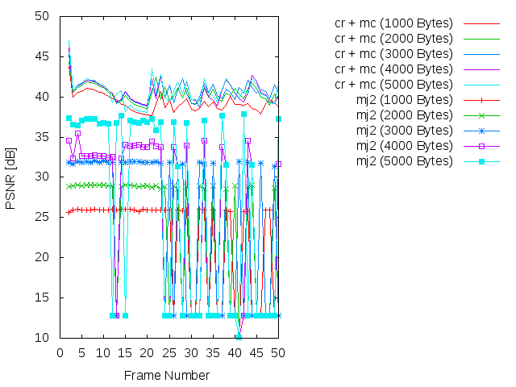
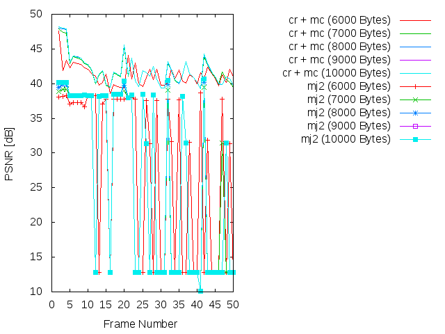

Experiment: 2015-07-09
======================

### Secuencia

- *speedway*
- Número de imágenes: **50**

### Información de la secuencia
* ~~Parámetros para la estimación de movimiento~~

* Parámetros de **kdu_compress**:

```
    CLAYERS=8
    CLEVELS=4
    CPRECINCTS="{128,128},{64,64},{32,32},{16,16},{16,16}"
    CBLK="{16,16}"
    CORDER=LRCP
```

* Layer size (in bytes):

Note: The resolution level 0 is the level with the bigger size of the image

```
Resolution level: 0
Layer: 1     Size: 5,275
Layer: 2     Size: 7,609
Layer: 3     Size: 10,700
Layer: 4     Size: 14,896
Layer: 5     Size: 20,589
Layer: 6     Size: 28,514
Layer: 7     Size: 39,478
Layer: 8     Size: 60,462

Resolution level: 1
Layer: 1     Size: 4,156
Layer: 2     Size: 6,924
Layer: 3     Size: 9,240
Layer: 4     Size: 13,395
Layer: 5     Size: 17,428
Layer: 6     Size: 24,280
Layer: 7     Size: 31,854
Layer: 8     Size: 41,764

Resolution level: 2
Layer: 1     Size: 2,798
Layer: 2     Size: 6,117
Layer: 3     Size: 8,405
Layer: 4     Size: 11,745
Layer: 5     Size: 15,695
Layer: 6     Size: 21,707
Layer: 7     Size: 29,007
Layer: 8     Size: 39,870

Resolution level: 3
Layer: 1     Size: 1,729
Layer: 2     Size: 5,590
Layer: 3     Size: 7,927
Layer: 4     Size: 11,046
Layer: 5     Size: 15,146
Layer: 6     Size: 20,813
Layer: 7     Size: 28,662
Layer: 8     Size: 39,652

Resolution level: 4
Layer: 1     Size: 923
Layer: 2     Size: 5,354
Layer: 3     Size: 7,637
Layer: 4     Size: 10,728
Layer: 5     Size: 14,924
Layer: 6     Size: 20,617
Layer: 7     Size: 28,542
Layer: 8     Size: 39,506
```


### Descripción

- Este experimento compara cómo sería la transmisión siguiendo el algoritmo
  **cr** frente a una transmisión Motion JPEG2000 (**mj2**). 
- La transmisión Motion JPEG2000 se simula truncando el *code-stream* a
  un determinado bitrate.
- La transmisión **cr** utiliza los siguientes parámetros:
    - WoisToCache: Modo 2 / Enviando 8 capas completas para precinto siguiendo una **LRCP**
    - Utiliza Knapsack: No
    - Utiliza **mc**: No
    - Bitrate estimado: De **1000 bytes** a **10000 bytes**

PSNR and SSIM
=============

### PSNR




### SSIM


### Average

| PSNR-SSIM \ Bytes | 1000            | 2000            | 3000            | 4000            | 5000           
| ----------------- | --------------- | --------------- | --------------- | --------------- | ---------------
| **PSNR(cr + mc)** |   |   |   |   | 
| **PSNR(mj2)**     |   |   |   |   | 
| **SSIM(cr + mc)** |   |   |   |   | 
| **SSIM(mj2)**     |   |   |   |   | 

| PSNR-SSIM \ Bytes | 6000            | 7000            | 8000            | 9000            | 10000           
| ----------------- | --------------- | --------------- | --------------- | --------------- | ---------------
| **PSNR(cr + mc)** |   |   |   |   | 
| **PSNR(mj2)**     |   |   |   |   | 
| **SSIM(cr + mc)** |   |   |   |   | 
| **SSIM(mj2)**     |   |   |   |   | 


Simulación de los resultados
=============

* Bitrate: 1000 bytes. [gif](gif/all_1000.gif) | [ogv](ogv/all_1000.ogv)
* Bitrate: 2000 bytes. [gif](gif/all_2000.gif) | [ogv](ogv/all_2000.ogv)
* Bitrate: 3000 bytes. [gif](gif/all_3000.gif) | [ogv](ogv/all_3000.ogv)
* Bitrate: 4000 bytes. [gif](gif/all_4000.gif) | [ogv](ogv/all_4000.ogv)
* Bitrate: 5000 bytes. [gif](gif/all_5000.gif) | [ogv](ogv/all_5000.ogv)
* Bitrate: 6000 bytes. [gif](gif/all_6000.gif) | [ogv](ogv/all_6000.ogv)
* Bitrate: 7000 bytes. [gif](gif/all_7000.gif) | [ogv](ogv/all_7000.ogv)
* Bitrate: 8000 bytes. [gif](gif/all_8000.gif) | [ogv](ogv/all_8000.ogv)
* Bitrate: 9000 bytes. [gif](gif/all_9000.gif) | [ogv](ogv/all_9000.ogv)
* Bitrate: 10000 bytes. [gif](gif/all_10000.gif) | [ogv](ogv/all_10000.ogv)