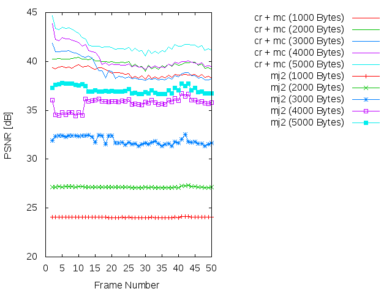
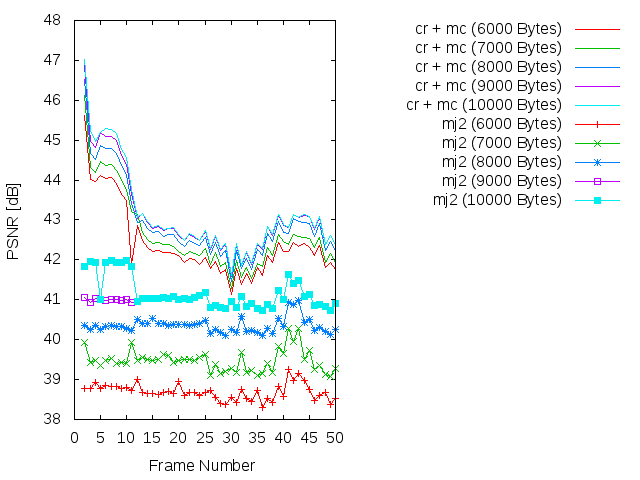

Experiment: 2015-07-10
======================

### Secuencia

- *speedway*
- Número de imágenes: **50**

### Información de la secuencia
* ~~Parámetros para la estimación de movimiento~~

* Parámetros de **kdu_compress**:

```
    CLAYERS=8
    CLEVELS=4
    CPRECINCTS="{128,128},{128,128},{128,128},{128,128},{128,128}"
    CBLK="{16,16}"
    CORDER=LRCP
```

* Layer size (in bytes):

Note: The resolution level 0 is the level with the bigger size of the image

```
Resolution level: 0
Layer: 1     Size: 5,134
Layer: 2     Size: 7,227
Layer: 3     Size: 10,125
Layer: 4     Size: 14,149
Layer: 5     Size: 19,747
Layer: 6     Size: 27,628
Layer: 7     Size: 38,692
Layer: 8     Size: 57,842

Resolution level: 1
Layer: 1     Size: 3,918
Layer: 2     Size: 6,481
Layer: 3     Size: 8,585
Layer: 4     Size: 12,635
Layer: 5     Size: 16,448
Layer: 6     Size: 22,665
Layer: 7     Size: 31,215
Layer: 8     Size: 40,074

Resolution level: 2
Layer: 1     Size: 2,580
Layer: 2     Size: 5,696
Layer: 3     Size: 7,725
Layer: 4     Size: 11,062
Layer: 5     Size: 14,619
Layer: 6     Size: 20,547
Layer: 7     Size: 27,935
Layer: 8     Size: 38,791

Resolution level: 3
Layer: 1     Size: 1,576
Layer: 2     Size: 5,261
Layer: 3     Size: 7,377
Layer: 4     Size: 10,360
Layer: 5     Size: 14,196
Layer: 6     Size: 19,843
Layer: 7     Size: 27,643
Layer: 8     Size: 38,719

Resolution level: 4
Layer: 1     Size: 953
Layer: 2     Size: 5,141
Layer: 3     Size: 7,234
Layer: 4     Size: 10,132
Layer: 5     Size: 14,156
Layer: 6     Size: 19,754
Layer: 7     Size: 27,635
Layer: 8     Size: 38,702
```


### Descripción

- Este experimento compara cómo sería la transmisión siguiendo el algoritmo
  **cr** frente a una transmisión Motion JPEG2000 (**mj2**). 
- La transmisión Motion JPEG2000 se simula truncando el *code-stream* a
  un determinado bitrate.
- La transmisión **cr** utiliza los siguientes parámetros:
    - WoisToCache: Modo 2 / Enviando 8 capas completas para precinto siguiendo una **LRCP**
    - Utiliza Knapsack: No
    - Utiliza **mc**: No
    - Bitrate estimado: De **1000 bytes** a **10000 bytes**

PSNR and SSIM
=============

### PSNR




### SSIM


### Average

| PSNR-SSIM \ Bytes | 1000            | 2000            | 3000            | 4000            | 5000           
| ----------------- | --------------- | --------------- | --------------- | --------------- | ---------------
| **PSNR(cr + mc)** |   |   |   |   | 
| **PSNR(mj2)**     |   |   |   |   | 
| **SSIM(cr + mc)** |   |   |   |   | 
| **SSIM(mj2)**     |   |   |   |   | 

| PSNR-SSIM \ Bytes | 6000            | 7000            | 8000            | 9000            | 10000           
| ----------------- | --------------- | --------------- | --------------- | --------------- | ---------------
| **PSNR(cr + mc)** |   |   |   |   | 
| **PSNR(mj2)**     |   |   |   |   | 
| **SSIM(cr + mc)** |   |   |   |   | 
| **SSIM(mj2)**     |   |   |   |   | 


Simulación de los resultados
=============

* Bitrate: 1000 bytes. [gif](gif/all_1000.gif) | [ogv](ogv/all_1000.ogv)
* Bitrate: 2000 bytes. [gif](gif/all_2000.gif) | [ogv](ogv/all_2000.ogv)
* Bitrate: 3000 bytes. [gif](gif/all_3000.gif) | [ogv](ogv/all_3000.ogv)
* Bitrate: 4000 bytes. [gif](gif/all_4000.gif) | [ogv](ogv/all_4000.ogv)
* Bitrate: 5000 bytes. [gif](gif/all_5000.gif) | [ogv](ogv/all_5000.ogv)
* Bitrate: 6000 bytes. [gif](gif/all_6000.gif) | [ogv](ogv/all_6000.ogv)
* Bitrate: 7000 bytes. [gif](gif/all_7000.gif) | [ogv](ogv/all_7000.ogv)
* Bitrate: 8000 bytes. [gif](gif/all_8000.gif) | [ogv](ogv/all_8000.ogv)
* Bitrate: 9000 bytes. [gif](gif/all_9000.gif) | [ogv](ogv/all_9000.ogv)
* Bitrate: 10000 bytes. [gif](gif/all_10000.gif) | [ogv](ogv/all_10000.ogv)