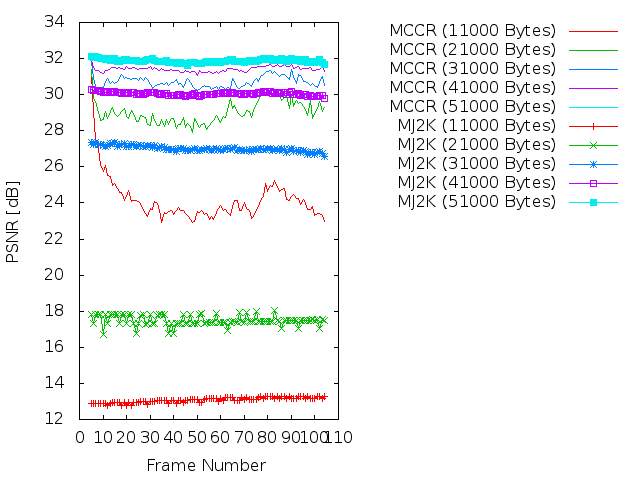
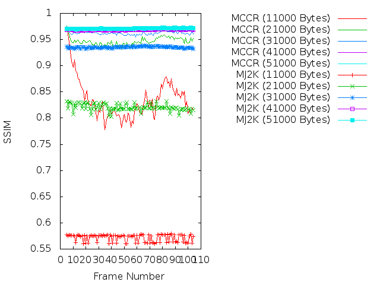
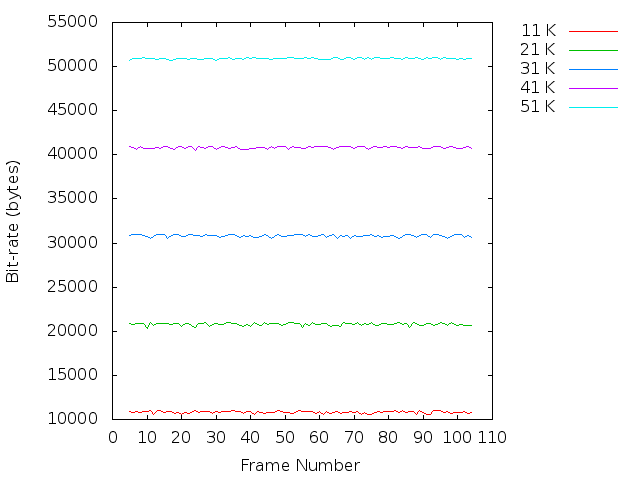

Experiment: 2018-11-03
======================

## Image sequence

- *stockholm*
- Number of frames: **100**

## Compression parameters used in kdu_compress

```
CLAYERS=8
CLEVELS=2
CPRECINCTS="{128,128},{64,64},{32,32}"
CBLK="{32,32}"
```

## Motion estimation parameters

```
X=1280
Y=768
B=128   # block size
A=0 	# subpixel accuracy = sub-pixel accuracy of the motion estimation
D=0     # border size = size of the border of the blocks in the motion estimation process
S=4     # search range = size of the searching area of the motion estimation
V=2     # Overlapping. Para difuminar los bordes de los bloques.
```

## PSNR



## SSIM



## Transmitted bitrate per frame



## Reconstructions

* Bitrate: 11000 bytes. [ogv](ogv/all_11000.ogv)
* Bitrate: 21000 bytes. [ogv](ogv/all_21000.ogv)
* Bitrate: 31000 bytes. [ogv](ogv/all_31000.ogv)
* Bitrate: 41000 bytes. [ogv](ogv/all_41000.ogv)
* Bitrate: 51000 bytes. [ogv](ogv/all_51000.ogv)