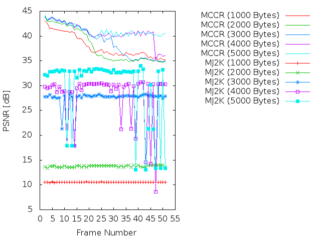
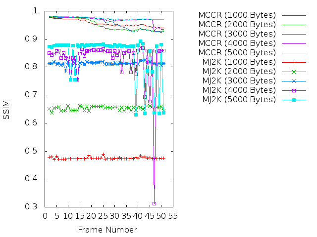
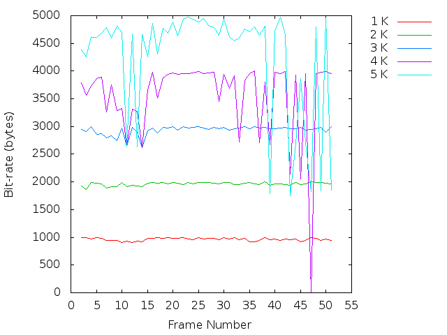

Experiment: 2018-11-05
======================

## Image sequence

- *speedway*
- Number of frames: **50**

## Compression parameters used in kdu_compress

```
CLAYERS=8
CLEVELS=2
CPRECINCTS="{64,64},{32,32},{16,16}"
CBLK="{16,16}"
CORDER=LRCP
```

## Motion estimation parameters

```
X=384
Y=320
B=64    # block size
A=0 	# subpixel accuracy = sub-pixel accuracy of the motion estimation
D=0     # border size = size of the border of the blocks in the motion estimation process
S=4     # search range = size of the searching area of the motion estimation
V=2     # Overlapping. Para difuminar los bordes de los bloques.
```

## PSNR



## SSIM



## Transmitted bitrate per frame



## Reconstructions

* Bitrate: 1000 bytes. [gif](gif/all_1000.gif) | [ogv](ogv/all_1000.ogv)
* Bitrate: 2000 bytes. [gif](gif/all_2000.gif) | [ogv](ogv/all_2000.ogv)
* Bitrate: 3000 bytes. [gif](gif/all_3000.gif) | [ogv](ogv/all_3000.ogv)
* Bitrate: 4000 bytes. [gif](gif/all_4000.gif) | [ogv](ogv/all_4000.ogv)
* Bitrate: 5000 bytes. [gif](gif/all_5000.gif) | [ogv](ogv/all_5000.ogv)