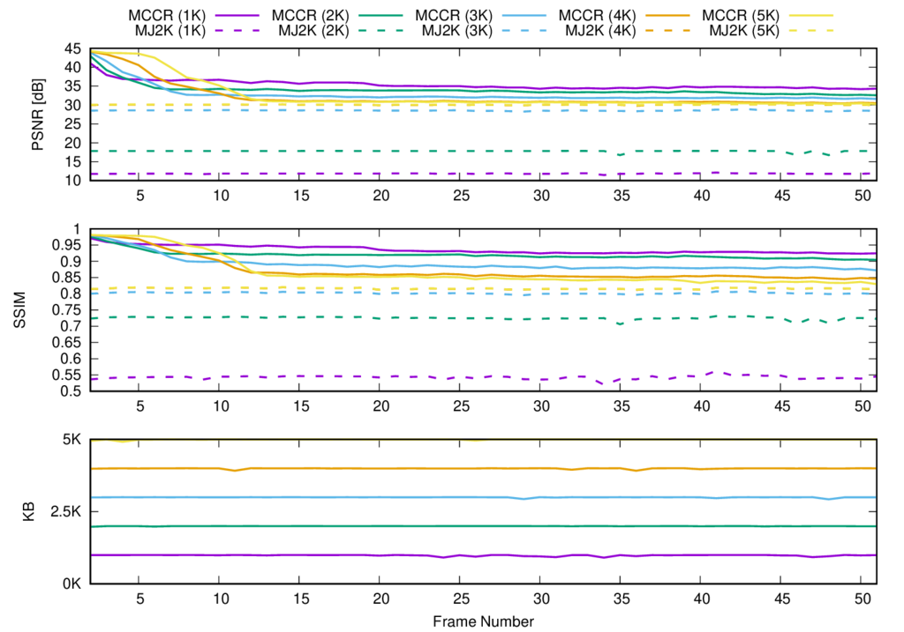
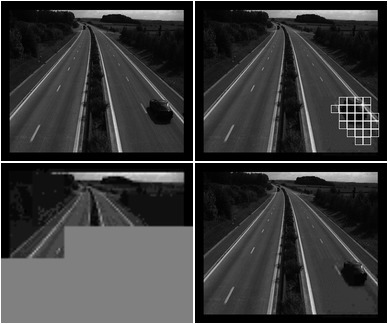

# Experiment: 2019-03-01 - (16, 16, 16. cblk = 16)

## Image sequence

- *speedway*
- Number of frames: **50**

## Compression parameters used in `kdu_compress`

```
kdu_compress -i 000.pgm -o 000.j2c Cuse_sop=yes Corder=LRCP Clayers=8 Clevels=2 Cprecincts="{16,16},{16,16},{16,16}" Cblk="{16,16}" Creversible=yes
```

```
CLAYERS=8
CLEVELS=2
CPRECINCTS="{16,16},{16,16},{16,16}"
CBLK="{16,16}"
CORDER=LRCP
```

```
Layer 1     Size:  7,030 bytes
Layer 2     Size: 12,481 bytes
Layer 3     Size: 18,363 bytes
Layer 4     Size: 24,832 bytes
Layer 5     Size: 32,214 bytes
Layer 6     Size: 40,780 bytes
Layer 7     Size: 51,096 bytes
Layer 8     Size: 97,040 bytes
```

## Motion estimation parameters

```
X=384
Y=320
B=16    # block size
A=0 	# subpixel accuracy = sub-pixel accuracy of the motion estimation
D=0     # border size = size of the border of the blocks in the motion estimation process
S=4     # search range = size of the searching area of the motion estimation
V=2     # Overlapping. Para difuminar los bordes de los bloques.
```

## PSNR, SSIM and Transmitted bitrate per frame



## Reconstructions

### Bitrate: 1000 bytes

[gif](gif/all_1000.gif) | [ogv](ogv/all_1000.ogv)



### Bitrate: 2000 bytes

[gif](gif/all_2000.gif) | [ogv](ogv/all_2000.ogv)


### Bitrate: 3000 bytes

[gif](gif/all_3000.gif) | [ogv](ogv/all_3000.ogv)


### Bitrate: 4000 bytes

[gif](gif/all_4000.gif) | [ogv](ogv/all_4000.ogv)


### Bitrate: 5000 bytes

[gif](gif/all_5000.gif) | [ogv](ogv/all_5000.ogv)


