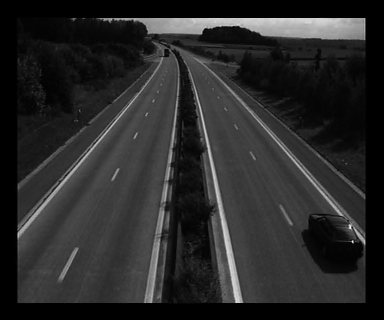
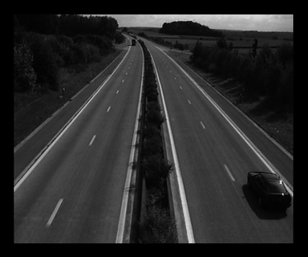

## Packets & Bytes

```
resolution    quality layer     packets       bytes    PSNR(reduce2) PSNR(reduce1)   PSNR(reduce0)
0                1                 29         2780     37.322744 	 27.129241 	 27.393105
(thumbnail)      2                 59         3550     41.506884 	 27.290665 	 27.548125
                 3                 89         4493     44.880823 	 27.330535 	 27.596544
                 4                 119        5095     47.607564 	 27.348451 	 27.612864
                 5                 149        6227     52.360300 	 27.355801 	 27.627685
                 6                 179        7348     1.000000 	 27.361820 	 27.625830
                 7                 209        7558     1.000000 	 27.361820 	 27.625830
                 8                 239        7795     1.000000 	 27.361820 	 27.625830

1                1                 269        9097     1.000000 	 36.076967 	 31.259631
                 2                 299        9903     1.000000 	 38.211872 	 31.638549
                 3                 329        10817    1.000000 	 40.141516 	 31.854027
                 4                 359        12631    1.000000 	 43.179766 	 32.047439
                 5                 389        14274    1.000000 	 45.376826 	 32.124740
                 6                 419        17157    1.000000 	 48.994682 	 32.185871
                 7                 449        19705    1.000000 	 52.642843 	 32.211382
                 8                 479        22022    1.000000 	 1.000000 	 32.229624

2                1                 509        22972    1.000000 	 1.000000 	 36.709862
                 2                 539        23850    1.000000 	 1.000000 	 38.601860
                 3                 569        25170    1.000000 	 1.000000 	 40.433285
                 4                 599        27053    1.000000 	 1.000000 	 42.395679
                 5                 629        30067    1.000000 	 1.000000 	 44.356402
                 6                 659        33993    1.000000 	 1.000000 	 46.129119
                 7                 689        42213    1.000000 	 1.000000 	 49.117520
                 8                 719        61141    1.000000 	 1.000000 	 1.000000
```

## Images
```
resolution    quality layer     packets       bytes    PSNR(reduce2) PSNR(reduce1)   PSNR(reduce0)
0                1                 29         2780     37.322744 	 27.129241 	 27.393105
```


```
resolution    quality layer     packets       bytes    PSNR(reduce2) PSNR(reduce1)   PSNR(reduce0)
0                2                 59         3550     41.506884 	 27.290665 	 27.548125
```


```
resolution    quality layer     packets       bytes    PSNR(reduce2) PSNR(reduce1)   PSNR(reduce0)
0                3                 89         4493     44.880823 	 27.330535 	 27.596544
```


```
resolution    quality layer     packets       bytes    PSNR(reduce2) PSNR(reduce1)   PSNR(reduce0)
0                4                 119        5095     47.607564 	 27.348451 	 27.612864
```


```
resolution    quality layer     packets       bytes    PSNR(reduce2) PSNR(reduce1)   PSNR(reduce0)
0                5                 149        6227     52.360300 	 27.355801 	 27.627685
```


```
resolution    quality layer     packets       bytes    PSNR(reduce2) PSNR(reduce1)   PSNR(reduce0)
0                6                 179        7348     1.000000 	 27.361820 	 27.625830
```


```
resolution    quality layer     packets       bytes    PSNR(reduce2) PSNR(reduce1)   PSNR(reduce0)
0                7                 209        7558     1.000000 	 27.361820 	 27.625830
```


```
resolution    quality layer     packets       bytes    PSNR(reduce2) PSNR(reduce1)   PSNR(reduce0)
0                8                 239        7795     1.000000 	 27.361820 	 27.625830
```


```
resolution    quality layer     packets       bytes    PSNR(reduce2) PSNR(reduce1)   PSNR(reduce0)
1                1                 269        9097     1.000000 	 36.076967 	 31.259631
```


```
resolution    quality layer     packets       bytes    PSNR(reduce2) PSNR(reduce1)   PSNR(reduce0)
1                2                 299        9903     1.000000 	 38.211872 	 31.638549
```


```
resolution    quality layer     packets       bytes    PSNR(reduce2) PSNR(reduce1)   PSNR(reduce0)
1                3                 329        10817    1.000000 	 40.141516 	 31.854027
```


```
resolution    quality layer     packets       bytes    PSNR(reduce2) PSNR(reduce1)   PSNR(reduce0)
1                4                 359        12631    1.000000 	 43.179766 	 32.047439
```


```
resolution    quality layer     packets       bytes    PSNR(reduce2) PSNR(reduce1)   PSNR(reduce0)
1                5                 389        14274    1.000000 	 45.376826 	 32.124740
```


```
resolution    quality layer     packets       bytes    PSNR(reduce2) PSNR(reduce1)   PSNR(reduce0)
1                6                 419        17157    1.000000 	 48.994682 	 32.185871
```


```
resolution    quality layer     packets       bytes    PSNR(reduce2) PSNR(reduce1)   PSNR(reduce0)
1                7                 449        19705    1.000000 	 52.642843 	 32.211382
```


```
resolution    quality layer     packets       bytes    PSNR(reduce2) PSNR(reduce1)   PSNR(reduce0)
1                8                 479        22022    1.000000 	 1.000000 	 32.229624
```


```
resolution    quality layer     packets       bytes    PSNR(reduce2) PSNR(reduce1)   PSNR(reduce0)
2                1                 509        22972    1.000000 	 1.000000 	 36.709862
```


```
resolution    quality layer     packets       bytes    PSNR(reduce2) PSNR(reduce1)   PSNR(reduce0)
2                2                 539        23850   1.000000 	 1.000000 	 38.601860
```


```
resolution    quality layer     packets       bytes    PSNR(reduce2) PSNR(reduce1)   PSNR(reduce0)
2                3                 569        25170    1.000000 	 1.000000 	 40.433285
```


```
resolution    quality layer     packets       bytes    PSNR(reduce2) PSNR(reduce1)   PSNR(reduce0)
2                4                 599        27053    1.000000 	 1.000000 	 42.395679
```




```
resolution    quality layer     packets       bytes    PSNR(reduce2) PSNR(reduce1)   PSNR(reduce0)
2                5                 629        30067    1.000000 	 1.000000 	 44.356402
```




```
resolution    quality layer     packets       bytes    PSNR(reduce2) PSNR(reduce1)   PSNR(reduce0)
2                6                 659        33993    1.000000 	 1.000000 	 46.129119
```


```
resolution    quality layer     packets       bytes    PSNR(reduce2) PSNR(reduce1)   PSNR(reduce0)
2                7                 689        42213    1.000000 	 1.000000 	 49.117520
```


```
resolution    quality layer     packets       bytes    PSNR(reduce2) PSNR(reduce1)   PSNR(reduce0)
2                8                 719        61141    1.000000 	 1.000000 	 1.000000
```


